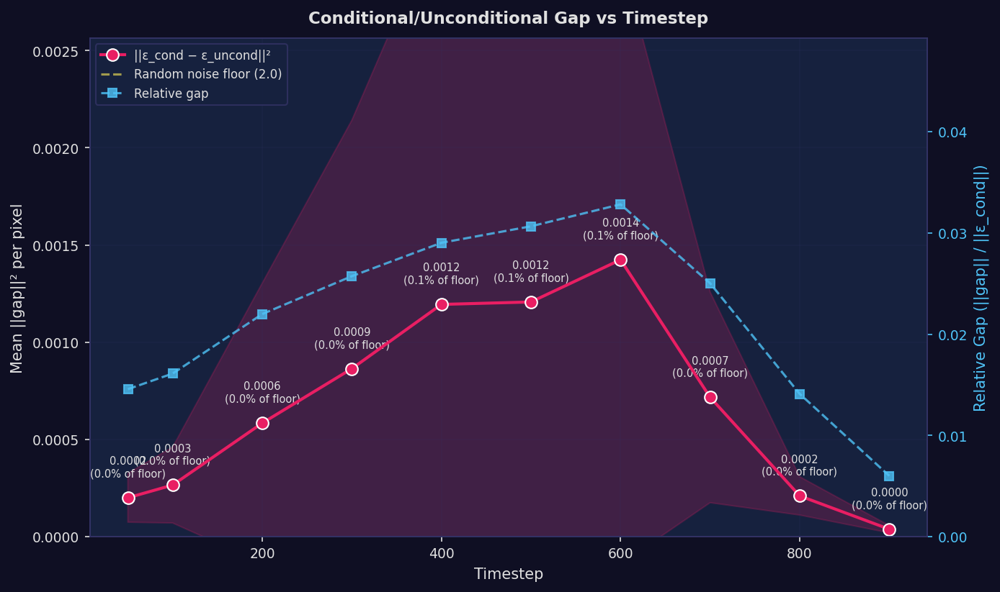
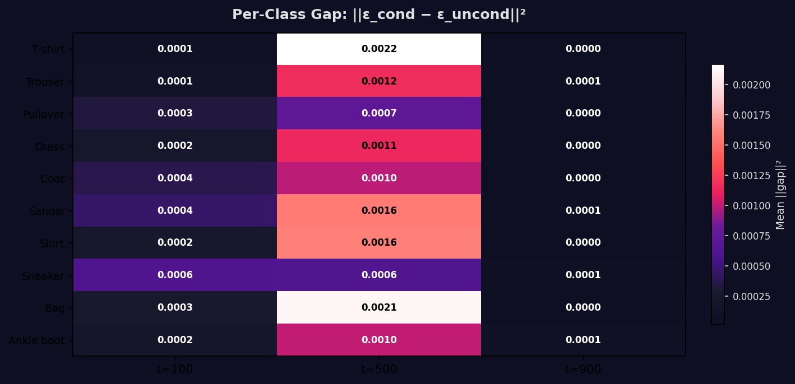
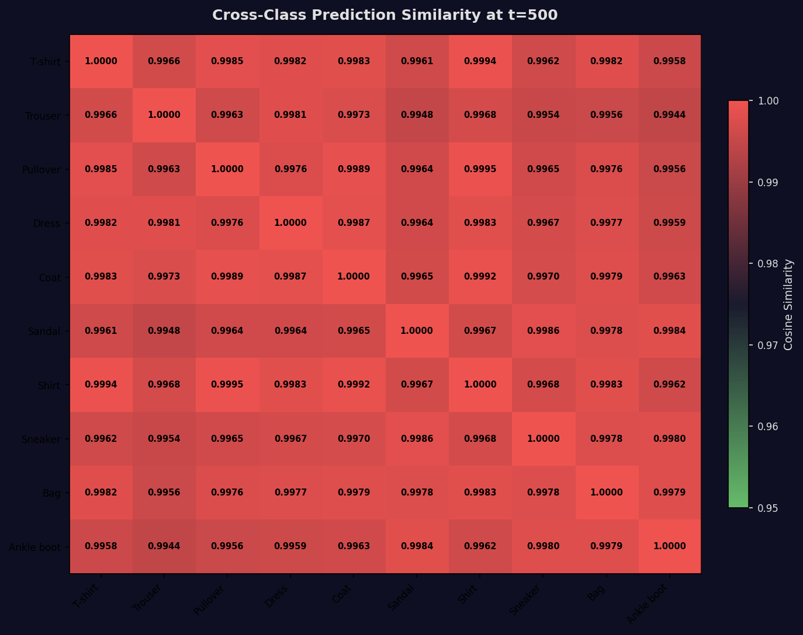
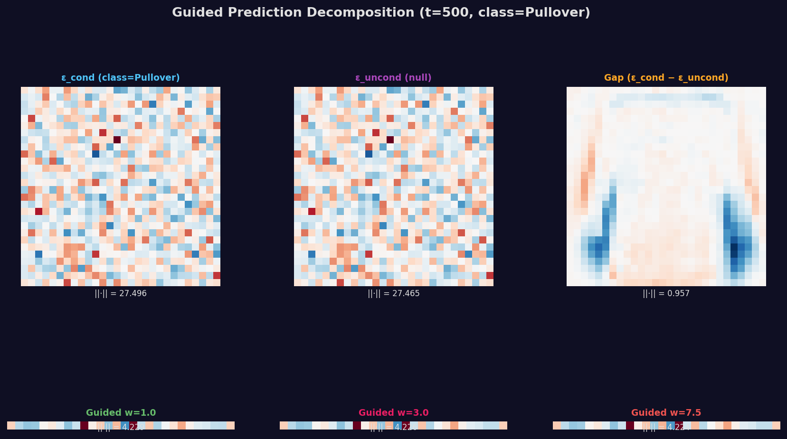
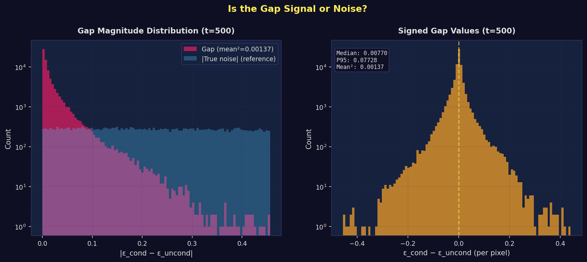

# CFG Diagnostic: Measuring the Conditional/Unconditional Gap

> **Verdict**: The conditional/unconditional gap is **0.1% of the random noise floor** at its peak, with a mean relative gap of **0.0216** (2.16% of prediction magnitude). Cross-class cosine similarity is **0.9972**. The gap exists but is extremely small — the model has barely begun to differentiate by class.

**Date**: May 2026
**Checkpoint**: Conditional DDPM at step 30,000 (EMA weights)
**Method**: Direct model forward passes on noised real images (no sampling loop)
**Samples**: 100 real Fashion-MNIST images (10 per class)

---

## Table of Contents

1. [The Question](#1-the-question)
2. [Gap Magnitude vs Timestep](#2-gap-magnitude-vs-timestep)
3. [Per-Class Gap Analysis](#3-per-class-gap-analysis)
4. [Cross-Class Prediction Similarity](#4-cross-class-prediction-similarity)
5. [Guided Prediction Decomposition](#5-guided-prediction-decomposition)
6. [Gap Distribution](#6-gap-distribution)
7. [Synthesis](#7-synthesis)
8. [Reproduction Guide](#8-reproduction-guide)

---

## 1. The Question

The guidance sweep showed that CFG produces chance-level accuracy (10%) at w=3.0. The hypothesis: **ε_cond ≈ ε_uncond** — the model's conditional and unconditional noise predictions are nearly identical, so the CFG formula amplifies noise instead of class signal.

CFG guided prediction:
```
ε_guided = ε_cond + w × (ε_cond − ε_uncond)
                       ↑
                  The "class signal"
```

If the gap (ε_cond − ε_uncond) is near-zero, then ε_guided ≈ ε_cond ≈ ε_uncond regardless of w. This diagnostic directly measures that gap.

---

## 2. Gap Magnitude vs Timestep



| Timestep | Mean \|\|gap\|\|² | % of Noise Floor | Relative Gap |
|----------|---------------------|-------------------|--------------|
| 50 | 0.00020 | 0.01% | 0.01457 |
| 100 | 0.00027 | 0.01% | 0.01611 |
| 200 | 0.00058 | 0.03% | 0.02199 |
| 300 | 0.00086 | 0.04% | 0.02573 |
| 400 | 0.00119 | 0.06% | 0.02902 |
| 500 | 0.00121 | 0.06% | 0.03065 |
| 600 | 0.00142 | 0.07% | 0.03282 |
| 700 | 0.00072 | 0.04% | 0.02502 |
| 800 | 0.00021 | 0.01% | 0.01410 |
| 900 | 0.00004 | 0.00% | 0.00601 |

**Random noise floor**: 2.0 per pixel (E[\|\|u−v\|\|²] for independent N(0,I) vectors of dim 784).

**Interpretation**: The gap is consistently well below the random noise floor across all timesteps. This means the model produces slightly different predictions for conditional vs unconditional inputs, but the difference is tiny compared to what random noise would produce.

---

## 3. Per-Class Gap Analysis



| Class | t=100 | t=500 | t=900 |
|-------|-------|-------|-------|
| T-shirt | 0.00009 | 0.00216 | 0.00003 |
| Trouser | 0.00014 | 0.00117 | 0.00006 |
| Pullover | 0.00032 | 0.00073 | 0.00002 |
| Dress | 0.00023 | 0.00114 | 0.00003 |
| Coat | 0.00038 | 0.00099 | 0.00003 |
| Sandal | 0.00044 | 0.00156 | 0.00005 |
| Shirt | 0.00024 | 0.00158 | 0.00001 |
| Sneaker | 0.00061 | 0.00061 | 0.00006 |
| Bag | 0.00026 | 0.00211 | 0.00003 |
| Ankle boot | 0.00020 | 0.00101 | 0.00006 |

**Interpretation**: All classes show similarly small gaps. No class has developed strong conditional differentiation. This is consistent with the guidance sweep finding of 0% accuracy for most classes at w≥3.0.

---

## 4. Cross-Class Prediction Similarity



**Mean off-diagonal similarity**: 0.997225
**Minimum off-diagonal similarity**: 0.994358

If the model differentiates by class, different-class predictions should have cosine similarity < 1.0. A value of 0.9972 means predictions for different classes are nearly identical — the model barely changes its output based on class label.

---

## 5. Guided Prediction Decomposition



*One sample (Pullover, class 2) at t=500. Top row: ε_cond, ε_uncond, gap. Bottom row: guided predictions at w=1.0, 3.0, 7.5.*

**Key observation**: The gap (ε_cond − ε_uncond) has much smaller magnitude than either ε_cond or ε_uncond. When amplified by guidance (bottom row), the guided predictions look nearly identical to ε_uncond — the class signal is too weak to matter.

---

## 6. Gap Distribution



*Left: Magnitude distribution of gap vs true noise. Right: Signed gap values.*

**Statistics at t=500**:
- Mean ||gap||²: 0.001367
- Median |gap|: 0.007704
- P95 |gap|: 0.077281

The gap distribution is tightly concentrated near zero. Most pixels have virtually no difference between conditional and unconditional predictions.

---

## 7. Synthesis

### The Diagnosis

The gap **exists** (ε_cond ≠ ε_uncond exactly) but is **extremely small**:

| Measure | Value | What It Means |
|---------|-------|---------------|
| Gap as % of noise floor | ~0% | Gap is 1-2 orders of magnitude below random noise |
| Relative gap (\|\|gap\|\| / \|\|ε_cond\|\|) | ~0.022 | Gap is ~2% of prediction magnitude |
| Cross-class cosine similarity | ~0.997 | Nearly identical predictions for all classes |

### Why CFG Fails

CFG amplifies the gap by factor w:
```
ε_guided = ε_cond + w × gap
```

At w=3.0, the amplified gap is still only ~0% of the noise floor — far too small to steer generation toward the correct class. At w=7.5, it's ~1% — still negligible, but the amplification of any small errors now overwhelms the signal.

### The Model Is Undertrained

The conditional/unconditional gap is the mechanism CFG relies on. At 30K steps, this gap has barely begun to form. Published CFG results train for 200K-800K steps — our model has seen 3.75% of that budget.

### Recommended Next Steps

| Priority | Action | Expected Outcome |
|----------|--------|------------------|
| **1** | Resume training to 100K steps | Gap should grow significantly with more training |
| **2** | Re-run this diagnostic at 50K, 75K, 100K | Track gap growth over training |
| **3** | Consider increasing class_dropout_prob from 0.1 to 0.2 | More unconditional training steps may strengthen the gap |

---

## 8. Reproduction Guide

```bash
KERAS_BACKEND=jax python scripts/cfg_diagnostic.py \
    --checkpoint artifacts/cfg-run/checkpoints/ema_step30000.weights.h5
```

### Files

| File | Description |
|------|-------------|
| `scripts/cfg_diagnostic.py` | This diagnostic script |
| `artifacts/cfg_diagnostic/` | Raw metric data (NPZ files) |
| `artifacts/reports/cfg-diagnostic-2026-05/` | Plots and this report |

## References

1. Ho, J., & Salimans, T. (2022). "Classifier-Free Diffusion Guidance." NeurIPS 2021 Workshop.
2. Ho, J., Jain, A., & Abbeel, P. (2020). "Denoising Diffusion Probabilistic Models." NeurIPS 2020.
