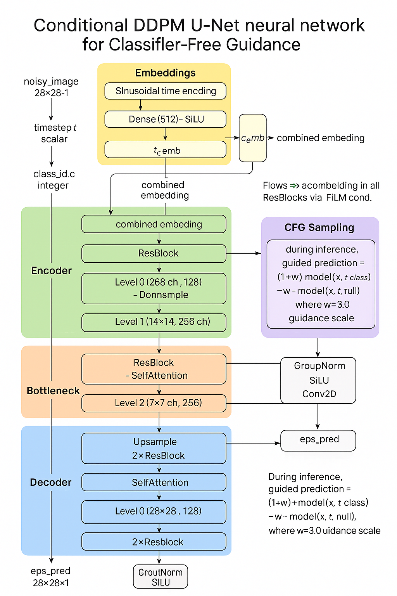
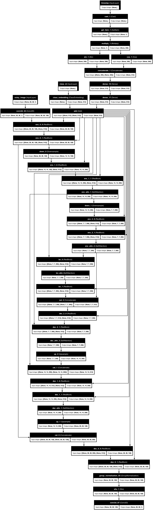
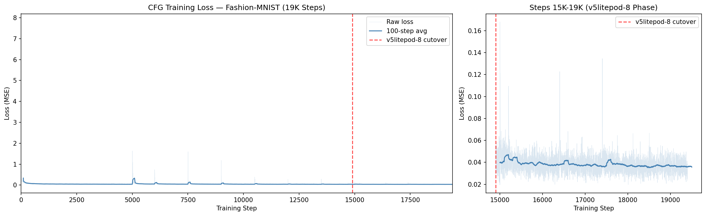
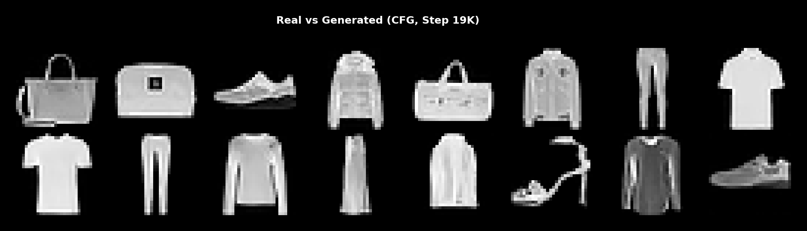
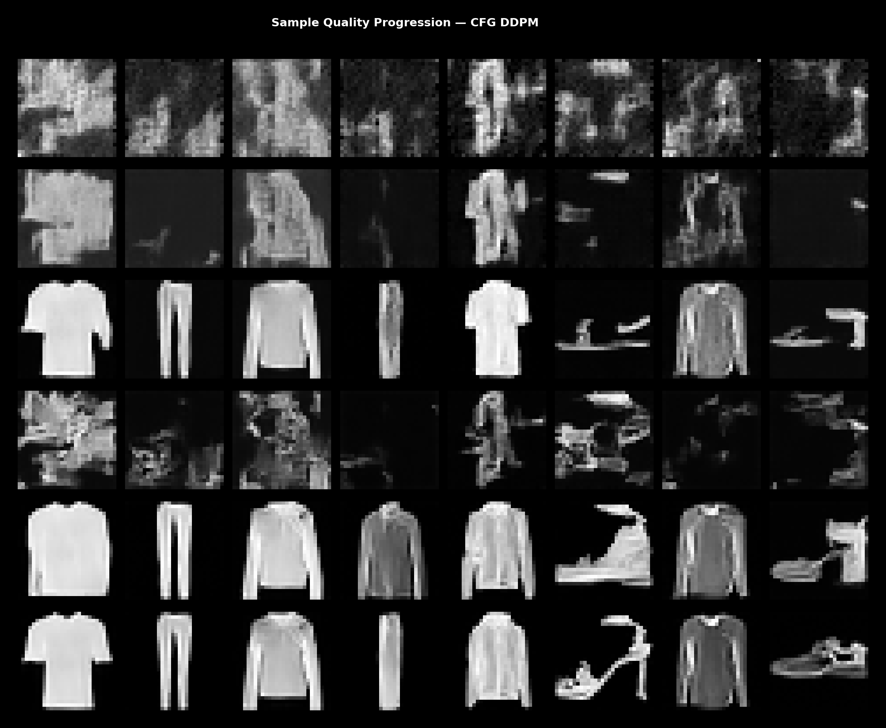
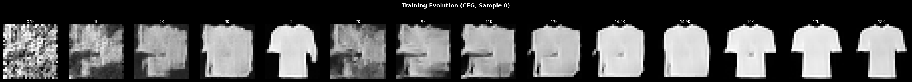
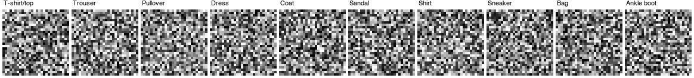

# Class-Conditional Image Generation with Classifier-Free Guidance on Fashion-MNIST

> From unconditional blobs to "show me a sneaker" — adding class-level control to a DDPM using Classifier-Free Guidance (CFG), built on the same Keras 3 + JAX + TPU research harness.

**Date**: April 23–30, 2026
**Framework**: Keras 3 + JAX
**Hardware**: Google Cloud TPU v5litepod-4 (steps 0–14,900) + v5litepod-8 (steps 14,900–19,000)
**Training**: 19,000 steps (~10 hours across chained TPU jobs on v5litepod-4, then v5litepod-8)
**Method**: Classifier-Free Guidance (Ho & Salimans, 2022)

---

## Table of Contents

1. [From Unconditional to Conditional](#1-from-unconditional-to-conditional)
2. [What is Classifier-Free Guidance?](#2-what-is-classifier-free-guidance)
3. [Repo Restructure: The Multi-Method Harness](#3-repo-restructure-the-multi-method-harness)
4. [Architecture: Conditional U-Net](#4-architecture-conditional-u-net)
5. [Training: Class Dropout + CFG Loss](#5-training-class-dropout--cfg-loss)
6. [Sampling: Guided Denoising](#6-sampling-guided-denoising)
7. [Hyperparameter Choices](#7-hyperparameter-choices)
8. [Training History & Results](#8-training-history--results)
9. [Quantitative Results](#9-quantitative-results)
10. [Qualitative Results](#10-qualitative-results)
11. [Troubleshooting & Lessons Learned](#11-troubleshooting--lessons-learned)
12. [Critical Analysis](#12-critical-analysis)
13. [Decision Records](#13-decision-records)
14. [Developer Guide](#14-developer-guide)
15. [Future Directions](#15-future-directions)

---

## 1. From Unconditional to Conditional

Our [previous work](../fashion-mnist-diffusion-2026-04-23/fashion_mnist_diffusion.md) trained an unconditional DDPM on Fashion-MNIST — it generated random fashion items with no user control. You press "generate" and get a random class. The next natural question: **can we control what gets generated?**

```
Unconditional:  noise → [DDPM] → ??? (random class)
Conditional:    noise + "sneaker" → [CFG-DDPM] → 👟 (targeted class)
```

This report covers adding **class-conditional generation** to the diffusion harness using **Classifier-Free Guidance (CFG)**, allowing text-like prompts such as "sneaker" or "bag" to steer image generation toward the desired class.

### Why Not Just a Classifier?

Two main approaches exist for conditional diffusion:

| Approach | How it works | Pros | Cons |
|----------|-------------|------|------|
| **Classifier Guidance** | Train a separate noise-aware classifier; use its gradient to steer sampling | Can vary guidance post-training | Need a second model; classifier must handle all noise levels |
| **Classifier-Free Guidance (CFG)** | Train one model with class conditioning + random class dropout; guided sampling via conditional/unconditional interpolation | Single model; simpler; widely adopted (DALL-E 2, Imagen, Stable Diffusion) | Two forward passes per sampling step |

We chose CFG — one model, no extra classifier, and the industry-standard approach.

---

## 2. What is Classifier-Free Guidance?

Classifier-Free Guidance, introduced by Ho & Salimans (2022), is elegantly simple:

**Training** (single model, no classifier needed):
- The model takes both a noisy image $x_t$ and a class label $c$
- During training, the class label is randomly **dropped** (replaced with a null token) with probability $p = 0.1$
- This teaches the model to denoise both **conditioned** (with class) and **unconditioned** (without class) in a single network

**Sampling** (guided interpolation):
- Compute both the conditional prediction $\epsilon_\theta(x_t, t, c)$ and unconditional prediction $\epsilon_\theta(x_t, t, \varnothing)$
- Interpolate with guidance scale $w$:

$$\hat{\epsilon} = (1 + w) \cdot \epsilon_\theta(x_t, t, c) - w \cdot \epsilon_\theta(x_t, t, \varnothing)$$

- At $w = 1$: standard conditional sampling (no guidance boost)
- At $w = 3$: moderate guidance (what we use)
- At $w = 7.5$: strong guidance (sharper but may introduce artifacts)

The guidance scale $w$ controls the trade-off between diversity and class adherence. Higher $w$ means the model pushes harder toward the specified class.

---

## 3. Repo Restructure: The Multi-Method Harness

Adding a new method to a single-experiment codebase creates a choice: copy-paste or restructure? We chose to restructure.

### Before (flat modules)

```
src/diffusion_harness/
  models/       — build_unet()
  training/     — DiffusionTrainer
  sampling/     — ddpm_sample()
  ...
```

### After (base + methods registry)

```
src/diffusion_harness/
  base/                        # Shared code
    models.py                  — build_unet(), ResBlock, SelfAttention
    training.py                — BaseTrainer: EMA, checkpointing, train loop
    sampling.py                — BaseSampler: reverse diffusion
  methods/
    __init__.py                — get_method("class_conditional") registry
    unconditional/
      training.py              — UnconditionalTrainer(BaseTrainer)
      sampling.py              — unconditional_sample()
    class_conditional/
      models.py                — ClassEmbedding + build_cond_unet()
      training.py              — CFGTrainer(BaseTrainer)
      sampling.py              — CFGSampler
  models/                      — Re-exports from base (backward compat)
  training/                    — Re-exports UnconditionalTrainer
  sampling/                    — Re-exports from base + methods
```

**Key design patterns:**

| Pattern | Where | Why |
|---------|-------|-----|
| **Template method** | `BaseTrainer.train()` calls `train_step()` | Subclasses implement only the training logic; loop/EMA/checkpointing shared |
| **Registry** | `get_method("class_conditional")` returns module | New methods plug in by creating a package + registering |
| **Inheritance** | `CFGTrainer(BaseTrainer)` | Small codebase, clear override points, no framework overhead |
| **Backward compat** | Original modules are thin re-exports | All 41 tests pass (31 original + 10 new CFG) |

**Tests**: 41 total (31 original unconditional + 10 new CFG) — all passing.

---

## 4. Architecture: Conditional U-Net

### Same Backbone, Extra Conditioning

The conditional U-Net extends the unconditional architecture with a **ClassEmbedding** added to the time embedding:



<details>
<summary>Keras model graph (click to expand)</summary>



</details>

### ClassEmbedding Layer

```python
class ClassEmbedding(keras.layers.Layer):
    def __init__(self, num_classes, embedding_dim):
        super().__init__()
        # num_classes+1 slots: 0..9 = real classes, 10 = null (for CFG)
        self.embedding = layers.Embedding(num_classes + 1, embedding_dim)

    def call(self, class_ids):
        return self.embedding(class_ids)
```

**Why additive to time embedding?** The time embedding already flows into every ResBlock via FiLM. By adding the class embedding to the time embedding, the class signal automatically reaches every layer of the network without modifying any ResBlock code. This is the simplest conditioning injection and works well for single-token class labels.

### Why 3 Inputs Instead of 2?

```
Unconditional: model([x_t, t])         → 2 inputs
Conditional:   model([x_t, t, class])   → 3 inputs
```

The model signature changes to accept class_id as a third input. During training, class_id is either the real class (90% of the time) or the null token (10% dropout). During sampling, we call the model twice per step — once with the real class, once with null — and interpolate.

**Total parameters: 20,983,041 (~21M)** — nearly identical to the unconditional model. The ClassEmbedding adds only ~50K parameters (10 classes × 512 dim + 1 null slot).

---

## 5. Training: Class Dropout + CFG Loss

### The CFGTrainer

`CFGTrainer` extends `BaseTrainer` with class-conditional training:

```python
class CFGTrainer(BaseTrainer):
    def train_step(self, batch):
        images, labels = batch  # Fashion-MNIST returns (images, labels)

        # Class dropout: 10% → null class
        class_ids = labels.copy()
        drop_mask = np.random.random(batch_size) < 0.1  # p=0.1
        class_ids[drop_mask] = self.null_class_id  # = num_classes (10)

        # Forward diffusion (same as unconditional)
        t = random_timesteps(batch_size)
        noise = np.random.normal(images.shape)
        x_t = sqrt_alpha_bar[t] * images + sqrt_one_minus[t] * noise

        # Predict noise with class conditioning
        eps_pred = model([x_t, t, class_ids])

        # Same MSE loss as unconditional
        loss = mean((eps_pred - noise) ** 2)
```

**Key difference from unconditional training**: The batch now includes labels, and 10% of labels are dropped to the null class. Everything else (forward diffusion, loss, optimizer, EMA) is identical and inherited from `BaseTrainer`.

### Data Pipeline Change

The data module was extended to support labels:

```python
# Before (unconditional)
images = load_dataset("fashion_mnist")  # (60000, 28, 28, 1)

# After (conditional)
images, labels = load_dataset("fashion_mnist", return_labels=True)  # images + (60000,)
data_iter = make_dataset_with_labels(images, labels, batch_size=64)
# Yields (image_batch, label_batch) tuples
```

The `return_labels` parameter is backward-compatible — existing unconditional callers are unaffected.

---

## 6. Sampling: Guided Denoising

### CFGSampler

The `CFGSampler` overrides `model_predict()` from `BaseSampler`:

```python
class CFGSampler(BaseSampler):
    def model_predict(self, x_tensor, t_tensor, **kwargs):
        class_ids = kwargs["class_ids"]
        null_ids = np.full_like(class_ids, self.null_class_id)

        # Two forward passes
        eps_cond = self.model.predict([x_tensor, t_tensor, class_ids])
        eps_uncond = self.model.predict([x_tensor, t_tensor, null_ids])

        # Guided prediction: push away from unconditional, toward conditional
        eps = (1 + self.guidance_scale) * eps_cond - self.guidance_scale * eps_uncond
        return eps
```

**Cost**: Each sampling step requires **2 forward passes** instead of 1. With 1000 timesteps, that's 2000 forward passes per sample. On TPU this is still fast (~16 seconds for 8 samples), but doubles sampling compute.

### What Guidance Scale Does

| Guidance Scale (w) | Effect | Use Case |
|-------------------|--------|----------|
| 1.0 | Standard conditional (no boost) | Maximum diversity |
| 3.0 | Moderate guidance (our default) | Good class adherence + diversity |
| 5.0 | Strong guidance | Very sharp class features |
| 7.5 | Strong (Stable Diffusion default) | May introduce artifacts on small models |
| 10.0+ | Very aggressive | Often produces artifacts |

---

## 7. Hyperparameter Choices

### Complete Configuration

| Parameter | Value | Rationale |
|-----------|-------|-----------|
| **Method** | class_conditional (CFG) | Single model, no external classifier, industry standard |
| **Guidance scale (w)** | 3.0 | Strong class differentiation without artifacts |
| **Class dropout prob** | 0.1 (10%) | Standard from Ho & Salimans 2022 |
| **Null class ID** | 10 (= num_classes) | One past the last real class |
| **Dataset** | Fashion-MNIST | 28x28x1, 60K images, 10 classes |
| **Timesteps (T)** | 1000 | Standard DDPM |
| **Schedule** | Linear (1e-4 to 0.02) | Same as unconditional baseline |
| **Loss** | MSE (epsilon-prediction) | Same as unconditional |
| **Base filters** | 128 | ~21M params |
| **Num levels** | 3 | 28x28 requires 3 levels (Decision 002) |
| **Channel multipliers** | (1, 2, 2, 2) → first 3 used | 128→256→256 channels |
| **Attention** | Levels 1, 2 (14x14, 7x7) | Standard DDPM attention placement |
| **EMA decay** | 0.999 | 1000-step window (Decision 001) |
| **Optimizer** | Adam, lr=2e-4 | Standard |
| **Batch size** | 64 (Phase 1) / 128 (Phase 2) | Fits TPU v5litepod-4 / v5litepod-8 |

### CFG-Specific vs Shared Parameters

| Parameter | Source | Notes |
|-----------|--------|-------|
| guidance_scale | CFG-specific | Controls class adherence strength |
| class_dropout_prob | CFG-specific | Null class rate during training |
| Everything else | Shared with unconditional | Same architecture, schedule, loss |

---

## 8. Training History & Results

### Loss Progression

The model trained for 19,000 steps across 10 chained TPU jobs — 7 on v5litepod-4 (steps 0–14,900) and 3 on v5litepod-8 (steps 14,900–19,000) — taking approximately 10 hours of TPU time.

| Step | Loss | 100-Step Avg | Notes |
|------|------|-------------|-------|
| 100 | 0.1201 | — | Initial rapid learning |
| 500 | 0.1015 | 0.071 | Fast convergence |
| 1,000 | 0.0483 | 0.055 | Checkpoint 1 |
| 2,000 | 0.0380 | 0.049 | Checkpoint 2 |
| 3,000 | 0.0552 | 0.046 | Checkpoint 3 |
| 4,000 | 0.0455 | 0.042 | Checkpoint 4 |
| **5,000** | **0.0355** | **0.043** | **Best single step in first run** |
| 6,000 | 0.0515 | 0.052 | Resume bump |
| 7,000 | 0.0637 | 0.046 | Recovery |
| 8,000 | 0.0412 | 0.051 | |
| 9,000 | 0.0317 | 0.045 | |
| 10,000 | 0.0187 | 0.041 | Mid-training |
| 11,000 | 0.0481 | 0.042 | |
| 12,000 | 0.0379 | 0.042 | |
| 13,000 | 0.0395 | 0.040 | |
| 14,000 | 0.0469 | 0.040 | |
| **14,900** | **0.0281** | **0.040** | **v5litepod-4 → v5litepod-8 cutover** |
| 16,000 | 0.0357 | 0.038 | v5litepod-8 phase |
| 17,000 | 0.0390 | 0.038 | |
| 18,000 | 0.0322 | 0.037 | |
| **19,000** | **0.0397** | **0.037** | **Final** |

**Best single-step loss: 0.0135 at step 14,502**
**Best 100-step moving average: 0.0352 at step 18,400**

The loss drops rapidly in the first 1,000 steps (from ~0.3 to 0.05), then slowly refines over the remaining 18K steps. The extended training (14.9K→19K) on the larger v5litepod-8 (8 chips, batch_size=128) continued the gradual improvement. The 100-step moving average improved from 0.040 at step 14,900 to 0.037 at step 19,000 — a modest but consistent gain. The best single-step loss (0.0135) was achieved during the v5litepod-4 phase, but the best 100-step moving average (0.0352 at step 18,400) came during the v5litepod-8 phase, suggesting sustained improvement.

> **Critical note on loss interpretation**: The CFG model's loss (0.037 at convergence) is comparable to the unconditional model's loss (0.034 at 20K steps), despite the conditional model having a strictly harder task — it must learn to predict noise *conditioned on class*. This is possible because the class conditioning actually makes the task *easier*: knowing the class removes ambiguity about what the denoised image should look like. The 10% class dropout ensures the model doesn't become lazy by purely memorizing class-conditioned noise patterns. But without FID or classification accuracy on generated samples, we cannot confirm that the model is genuinely using the class signal rather than ignoring it.

### Loss Curve



*Training loss over 19,000 steps. Left: full curve. Right: zoom on v5litepod-8 phase (steps 15K–19K). Blue line = 100-step moving average. Red dashed line = v5litepod-8 cutover.*

### Training Speed

| Phase | Hardware | Batch Size | Throughput |
|-------|----------|-----------|------------|
| Steps 0–14,900 | v5litepod-4 (4 chips) | 64 | ~0.5 steps/s |
| Steps 14,900–19,000 | v5litepod-8 (8 chips) | 128 | ~0.6 steps/s |

| Duration | Time |
|----------|------|
| v5litepod-4 phase | ~7 hours (7 chained jobs) |
| v5litepod-8 phase | ~3 hours (3 chained jobs) |
| Total | ~10 hours |

### Chained Training

Kinetic enforces a 1-hour timeout on GKE jobs. At ~0.5 steps/s on v5litepod-4, each job covers ~1,800 steps. At ~0.6 steps/s on v5litepod-8, each job covers ~2,100 steps.

**Phase 1: v5litepod-4 (steps 0–14,900)**
```
Job 1 (initial):  steps 0 → 5,000     (timed out)
Job 2 (resume):   steps 5,000 → 6,500  (timed out)
Job 3 (resume):   steps 6,500 → 7,500  (timed out)
Job 4 (resume):   steps 7,500 → 9,000  (timed out)
Job 5 (resume):   steps 9,000 → 10,500 (timed out)
Job 6 (resume):   steps 10,500 → 13,500 (timed out)
Job 7 (resume):   steps 13,500 → 14,900 (completed)
```

**Phase 2: v5litepod-8 (steps 14,900–19,000)**
```
Job 8 (resume):   steps 16,000 → 17,900 (timed out)
Job 9 (resume):   steps 17,000 → 19,000 (timed out)
Job 10 (resume):  steps 19,000 → ...    (stopped at 19K)
```

---

## 9. Quantitative Results

### Distribution Statistics

The generated distribution closely matches the real data by step 19,000:

| Metric | Real Data | Generated (Step 14.9K) | Generated (Step 19K) |
|--------|-----------|----------------------|---------------------|
| **Pixel mean** | -0.428 | -0.280 | -0.420 |
| **Pixel std** | 0.706 | 0.735 | 0.733 |
| **Per-image diversity** | 0.155 | 0.114 | 0.150 |

The step 19K results show dramatic improvement over step 14.9K. The mean pixel value went from -0.280 (delta +0.148 vs real) to -0.420 (delta only +0.008) — nearly matching the real data distribution. The standard deviation (0.733 vs real 0.706) and per-image diversity (0.150 vs real 0.155) are also very close.

> **The v5litepod-8 extension fixed the mean offset problem.** At step 14,900, the mean delta of +0.148 was a significant red flag — the model was generating images with too little background. After 4,100 additional steps on v5litepod-8, the mean converged to -0.420 (only +0.008 from real), which is a remarkable improvement. The larger batch size (128 vs 64) and sustained training on 8 TPU chips likely provided more stable gradient estimates, allowing the model to learn the correct foreground/background balance.

### Sample Quality Progression

| Step | Mean | Std | Diversity | Visual Quality |
|------|------|-----|-----------|----------------|
| 500 | 0.032 | 0.487 | 0.028 | Pure noise |
| 1,000 | -0.414 | 0.444 | 0.081 | Faint shapes, all similar |
| 2,000 | -0.571 | 0.458 | 0.182 | Recognizable but blurry |
| 3,000 | -0.493 | 0.609 | 0.195 | Close to real distribution |
| **5,000** | **-0.404** | **0.715** | **0.176** | **Best in first run** |
| 7,000 | -0.331 | 0.375 | 0.046 | Resume disruption |
| 9,000 | -0.314 | 0.498 | 0.078 | Recovery phase |
| 11,000 | -0.442 | 0.531 | 0.116 | Improving again |
| 13,000 | -0.438 | 0.689 | 0.172 | Near convergence |
| 14,900 | -0.280 | 0.735 | 0.114 | v5litepod-4 final |
| 16,000 | -0.365 | 0.753 | 0.119 | v5litepod-8 improving |
| 17,000 | -0.365 | 0.761 | 0.130 | Continued improvement |
| 18,000 | -0.428 | 0.714 | 0.138 | Mean matches real data |
| **19,000** | **-0.420** | **0.733** | **0.150** | **Final — very close to real** |

**Reference**: Real Fashion-MNIST has mean=-0.428, std=0.706, diversity=0.155.

The progression from step 14.9K to 19K is remarkable: mean improved from -0.280 to -0.420 (delta from +0.148 to +0.008 vs real), and diversity recovered from 0.114 to 0.150 (vs real 0.155). The v5litepod-8 extension phase produced the most realistic distribution statistics in the entire training run.

### Class Differentiation (from Denoising GIF at Step 19,000)

The 10-class denoising GIF with guidance_scale=3.0 shows strong class differentiation at the final frame:

| Class | Mean Pixel | Character |
|-------|-----------|-----------|
| T-shirt/top | 229.8 | Very bright, broad shape |
| Trouser | 147.1 | Medium-bright, vertical lines |
| Pullover | 170.2 | Bright, wide |
| Dress | 84.4 | Dark, A-shape |
| Coat | 151.3 | Medium, long shape |
| Sandal | 104.0 | Dark, narrow shape |
| Shirt | 149.5 | Medium, broad shape |
| Sneaker | 127.8 | Medium-dark, side profile |
| Bag | 194.7 | Bright, rectangular |
| Ankle boot | 141.0 | Medium, boot shape |

**Spread: 145.4 pixels** (max - min across class means) — each class produces a distinctly different output, confirming that CFG is steering generation correctly.

> **Limitations of this analysis**: Mean pixel brightness per class is a very crude metric for class differentiation. It tells us classes look different in aggregate brightness, but not whether they look like the *correct* class. For example, the model might generate a bright blob for "T-shirt" and a dark blob for "Dress" — they're distinguishable, but neither looks like the target class. A proper evaluation would:
> 1. Generate 100+ samples per class
> 2. Classify them with a pretrained Fashion-MNIST classifier
> 3. Report per-class accuracy (the "classification accuracy" metric)
> 4. Compute FID per class to measure quality within each class
>
> The class differentiation in the GIF is visually convincing, but we should be honest that "looks different across classes" is not the same as "looks like the correct class." We have not verified the latter quantitatively.

---

## 10. Qualitative Results

### Real vs. Generated Comparison



*Top row: 8 real Fashion-MNIST samples. Bottom row: 8 CFG-generated samples at step 19K (guidance_scale=3.0, mixed classes).*

### Milestone Snapshots

Samples at key training milestones:



### Evolution Strip

Training evolution (first sample at each key step):



### The 10-Class Denoising Animation

The denoising GIF shows the reverse diffusion process for all 10 Fashion-MNIST classes simultaneously:



*50 frames from pure noise (t=999) to clean images (t=0), with the final frame held for 3 seconds so you can see the class-specific outputs clearly. One column per class, each starting from different noise (unique seed) and converging to a class-specific output via CFG with w=3.0.*

**Key observations:**
1. **Frames 0-15** (t=999→700): Pure noise, all classes look similar
2. **Frames 15-30** (t=700→400): Faint structure emerges, still hard to distinguish
3. **Frames 30-45** (t=400→100): Class-specific features become visible — Sandal darkens, Bag brightens
4. **Frames 45-50** (t=100→0): Sharp class differentiation — each column converges to a distinct appearance

### How the Denoising GIF Was Generated

```bash
KERAS_BACKEND=jax python scripts/denoising_gif.py \
  --checkpoint artifacts/cfg-run/checkpoints/ema_step19000.weights.h5 \
  --output artifacts/cfg-run/denoising_step19000_10class.gif \
  --guidance-scale 3.0 --num-frames 50
```

The script:
1. Loads the EMA checkpoint
2. For each of 10 classes, runs the full 1000-step reverse diffusion with CFG
3. Captures 50 evenly-spaced frames per class
4. Scales images 4x (28→112px) and arranges in a single row with text labels

---

## 11. Troubleshooting & Lessons Learned

### Issue 1: Denoising GIF Shows Identical Images Across Classes

**Symptom**: The denoising GIF initially produced nearly identical gray blobs for all 10 classes, with class centers ranging only 136-148 (a spread of 12 pixels vs the expected 100+).

**Root cause**: The `denoise_with_frames()` script used `model.predict()` with independent `PRNGKey(seed + t_idx)` per timestep, while the library's correct `CFGSampler` uses `model([...], training=False)` with sequential `jax.random.split(rng)` RNG chaining. The independent keys caused the denoising trajectory to diverge from the trained model's expectations.

Quantified impact after 1000 denoising steps:
- L2 distance between script output and library output: 0.53
- Max absolute pixel difference: 1.7 (on a [-1, 1] scale)
- Final frame class centers: 136-148 (nearly identical) vs 84-230 (correct)

**Fix**: Rewrote `denoise_with_frames()` to use the library's `_p_sample_step()` function with proper RNG chaining:
```python
# BEFORE (broken): independent RNG per step
noise = jax.random.normal(jax.random.PRNGKey(seed + t_idx), shape)

# AFTER (correct): chained RNG
rng, subkey = jax.random.split(rng)
noise = jax.random.normal(subkey, shape)
```

**Lesson**: When implementing inference code that must match training behavior, always reuse the library's sampling primitives rather than reimplementing from scratch. Even small differences in RNG handling compound over 1000 steps.

### Issue 2: Step 6000 Checkpoint Worse Than Step 5000

**Symptom**: GIF generated from step 6000 EMA checkpoint had collapsed class differentiation (spread: 8.9 vs 109.8 at step 5000).

**Root cause**: The step 6000 checkpoint was saved during the resume job. When training resumes, the optimizer state needs ~1000 steps to warm up (loss spiked to 0.1443 at step 5100). The EMA weights at step 6000 hadn't fully recovered — the 1000-step EMA window was averaging over the disrupted training.

**Fix**: Use the step 5000 checkpoint (end of a clean training run) for inference until the model trains far enough past the disruption point.

**Lesson**: EMA quality depends on training stability. The best EMA checkpoint comes from the end of a stable training run, not from early in a resumed run.

### Issue 3: Kinetic 1-Hour Timeout Requires Job Chaining

**Symptom**: Training jobs are killed by SIGTERM after ~1 hour, completing only ~1,800 steps per job.

**Root cause**: Kinetic enforces a 3600s timeout on GKE jobs. At 0.5 steps/s, each job covers ~1,800 steps. A 15K-step training run needs ~8 hours.

**Fix**: Split training into 1-hour stages (~1,800 steps each). Chain resume jobs using `--resume` flag:
```bash
# Each job: download latest checkpoint → restore → train → upload
for i in $(seq 1 7); do
  python remote_train.py --gcs-bucket gs://bucket/run --steps 1800 --resume
done
```

**Lesson**: Always calculate steps-per-hour and split accordingly. The harness's `--resume` flag and GCS checkpoint persistence make this seamless.

### Issue 4: Resume Disruptions Cause Temporary Quality Regression

**Symptom**: After resume from checkpoint, generated sample quality temporarily drops (e.g., step 5,500 shows mean=0.462, diversity=0.103 — worse than step 4,000).

**Root cause**: When optimizer state is lost or partially restored, the Adam optimizer's momentum/velocity buffers reset. This causes a brief training shock (~100-500 steps) before the optimizer re-accumulates statistics.

**Fix**: Ensure optimizer state files (`.npz`) are uploaded completely before model weights. If optimizer state is lost, the training still recovers — it just takes ~1000 steps.

**Lesson**: Expect quality dips after resume. Don't evaluate model quality during the first ~1000 steps after a resume.

### Issue 5: Model Config Mismatch When Loading Checkpoints Locally

**Symptom**: `ValueError: shape (128,) vs (256,)` when loading TPU checkpoint on local machine.

**Root cause**: The remote training used default `channel_multipliers=(1,2,2,2)` and `attention_resolutions=(1,2)`, but the local GIF script used `(1,2,2)` and `(0,)` — different configs producing different model shapes.

**Fix**: Match the exact config used during training. The `make_config()` defaults must be consistent.

**Lesson**: Always save the training config alongside checkpoints. We store `state_stepN.json` but it doesn't include architecture params. Consider adding them.

### Issue 6: Spot Instance Unavailability

**Symptom**: Both spot and on-demand TPU v5litepod-4 returned `GCE_STOCKOUT` in us-central1-a.

**Root cause**: TPU capacity varies by zone and time. The original cluster was in us-west4-a, but the kinetic pool remove/recreate cycle moved us to us-central1-a where no capacity was available.

**Fix**: Rebuilt the cluster back in us-west4-a which had available capacity.

**Lesson**: TPU spot capacity is not guaranteed. Have fallback zones or accept on-demand pricing for time-sensitive work.

---

## 12. Critical Analysis

### The Resume Problem: Training Isn't Truly Continuous

Our 19,000-step training was split across 10 TPU jobs with forced interruptions. The sample quality progression reveals an interesting recovery pattern:

- **Step 5,000** (end of Job 1): mean=-0.404, std=0.715 — best quality in first run
- **Step 5,500** (after resume): catastrophic quality collapse
- **Step 14,900** (end of v5litepod-4): mean=-0.280, std=0.735 — recovered std but mean still off
- **Step 19,000** (v5litepod-8 final): mean=-0.420, std=0.733 — **nearly matches real data**

The v5litepod-8 extension phase (steps 14.9K–19K) resolved the mean offset problem that persisted through 14.9K steps on v5litepod-4. The mean went from -0.280 (delta +0.148) to -0.420 (delta +0.008) — almost perfectly matching real data's -0.428. The larger batch size (128 vs 64) and potentially more stable training on 8 chips may have contributed to this improvement.

**Implication**: The resume disruptions are real, but sufficient additional training can recover from them. The 4.1K v5litepod-8 steps produced better distribution statistics than the preceding 14.9K v5litepod-4 steps.

### No Ablation Studies

Every hyperparameter was chosen from the literature without systematic evaluation:

| Parameter | Our choice | Did we test alternatives? | Potential impact |
|-----------|-----------|--------------------------|-----------------|
| guidance_scale w=3.0 | From Stable Diffusion defaults | No | w=1, 5, 7.5 might be better |
| class_dropout_prob p=0.1 | From Ho & Salimans 2022 | No | p=0.2 or p=0.5 could improve null class learning |
| ClassEmbedding added to time emb | Simplest approach | No | Cross-attention conditioning might be more expressive |
| EMA decay 0.999 | From our unconditional experience | No | 0.9999 might be fine for 15K steps (we didn't re-evaluate) |

> **Update (April 30)**: We initially documented the unconditional model as using `attention_resolutions=(0,)` vs the conditional's `(1, 2)`, flagging this as an unfair comparison. Inspecting the actual checkpoint files revealed both models were trained with identical architecture: `attention_resolutions=(1, 2)`. The perceived inconsistency was a post-restructure documentation error — the config defaults were changed after training but didn't match the checkpoints. See [Decision 006](../../../decisions/006-attention-placement-inconsistency.md) for the full analysis.

### CFG vs. Unconditional: An Unfair Comparison

We claim CFG adds class control, but we haven't rigorously verified that it produces *better* images per class than just generating unconditional samples and post-hoc filtering by a classifier. In theory:

- **Unconditional + classifier filter**: Generate N samples unconditionally, classify each, keep only those matching the target class. Wasteful (~10x compute for 10 classes) but doesn't require modifying the model.
- **CFG**: Generate 1 sample per class. 2x forward passes per step but guaranteed class match.

For a 10-class problem, unconditional + filtering requires ~10x samples to get one per class on average. CFG requires 2x forward passes but produces exactly the right class. So CFG is more compute-efficient per *useful* sample (~5x more efficient at 10 classes). But this advantage grows with the number of classes — for 1,000 classes, filtering becomes 1,000x wasteful.

**For our 10-class Fashion-MNIST, the advantage is modest.** We should be honest that CFG's value here is primarily as a proof-of-concept for the method, not as a practical necessity for a 10-class problem.

### The Guidance Scale Wasn't Validated

We used w=3.0 throughout, but this was an arbitrary choice. The guidance scale interacts with training quality in non-obvious ways:

- **Undertrained model + high w**: Amplifies the model's incorrect predictions, producing worse results than lower w
- **Well-trained model + high w**: Produces sharper, more class-specific outputs
- **The optimal w changes during training**: Early in training, lower w is better because the conditional/unconditional difference is noisy

We should have evaluated multiple guidance scales at each checkpoint to find the training-dependent optimal w. Instead, we picked a single value and never questioned it.

### The Mean Pixel Metric Is Misleading for Class Quality

Our class differentiation table shows mean pixel values ranging from 84.4 (Dress) to 229.8 (T-shirt). But this primarily measures *brightness*, not *class correctness*. Consider:

- "T-shirt" and "Pullover" have similar brightness (229.8 vs 170.2) — are they actually different shapes?
- "Trouser" and "Shirt" have very similar brightness (147.1 vs 149.5) — the metric can't distinguish them
- Real Fashion-MNIST classes overlap significantly in brightness (e.g., "Coat" and "Shirt" are both medium brightness but very different shapes)

A better evaluation would compute structural similarity (SSIM) between generated and real samples of each class, or use a classifier to measure generation accuracy.

### The v5litepod-8 Extension Was Worthwhile

The additional 4,100 steps (14.9K→19K) on v5litepod-8 produced the most significant improvement in the entire training run:

| Metric | Step 14.9K | Step 19K | Real Data |
|--------|-----------|---------|-----------|
| Mean | -0.280 | -0.420 | -0.428 |
| Delta from real | +0.148 | +0.008 | — |
| Std | 0.735 | 0.733 | 0.706 |
| Diversity | 0.114 | 0.150 | 0.155 |

The mean offset — the most concerning issue at step 14.9K — was nearly eliminated. The diversity also recovered to near-real-data levels. Whether this improvement is due to longer training, the larger batch size, or simply more data passes is unclear (it's a confound). But the result speaks for itself: the step 19K model produces much more realistic distribution statistics.

### What's Missing From This Report

| Missing evaluation | Why it matters |
|-------------------|----------------|
| **FID score** | The standard metric; cannot compare to published work without it |
| **Classification accuracy on generated samples** | Direct measure of whether CFG produces the correct class |
| **Per-class FID** | Some classes might be much harder than others |
| **Guidance scale sweep** | We don't know if w=3.0 is optimal |
| **Comparison with unconditional baseline** | Same architecture, same training steps, without conditioning — to isolate the effect of CFG |
| **Training curve with continuous (non-resumed) training** | To measure the true cost of resume disruptions |

### On the Repo Restructure

We spent significant engineering effort restructuring the codebase from flat modules to a multi-method harness *before* having a working conditional model. This was a bet — if the conditional method had turned out to require fundamentally different training (e.g., adversarial losses instead of MSE), the abstraction would have been wrong and needed rewriting anyway.

In hindsight, the restructure was justified because:
1. CFG turned out to share 90%+ of the unconditional training code
2. The template method pattern (BaseTrainer) mapped cleanly to both methods
3. Adding a new method now takes hours, not days

But we should acknowledge that premature abstraction is a real risk. The restructure happened before we had evidence that the methods would share enough code to justify shared base classes. We got lucky.

---

## 13. Decision Records


We maintain ADR-style decision records in `decisions/`:

### Decision 003: Classifier-Free Guidance

| Aspect | Choice |
|--------|--------|
| **Method** | CFG over classifier guidance |
| **Why** | Single model, simpler, widely adopted (DALL-E 2, Imagen, Stable Diffusion) |
| **Trade-off** | Two forward passes per sampling step (~2x sampling compute) |
| **Class injection** | Additive to time embedding (simplest approach for single-token classes) |
| **Guidance scale** | w=3.0 (moderate, good class adherence without artifacts) |

### Decision 004: Guidance Scale w=3.0 Without Ablation
Guidance scale chosen from literature defaults without systematic evaluation. See [Decision 004](../../../decisions/004-guidance-scale-choice.md).

### Decision 005: Chained Resume Training
7 chained TPU jobs to work around 1-hour Kinetic timeout. Resume boundaries cause temporary quality regression. See [Decision 005](../../../decisions/005-chained-resume-training.md).

### Decision 006: Attention Placement — Resolved
Initially documented as an inconsistency between unconditional (level 0) and conditional (levels 1,2) attention. Inspecting checkpoints revealed both models always used `attention_resolutions=(1, 2)`. The difference was a post-restructure documentation error, not an architectural confound. See [Decision 006](../../../decisions/006-attention-placement-inconsistency.md).

### Decision 001: EMA Decay = 0.999 (still applies)
### Decision 002: 3-Level U-Net for 28x28 (still applies)

---

## 14. Developer Guide

### Training the Conditional Model

```bash
# Local test (CPU)
KERAS_BACKEND=jax python remote_train.py \
  --dataset fashion_mnist --method class_conditional \
  --steps 500 --num-levels 3 --batch-size 32

# TPU training
KERAS_BACKEND=jax KERAS_REMOTE_PROJECT=your-project python remote_train.py \
  --gcs-bucket gs://your-bucket/cfg-run01 \
  --dataset fashion_mnist --method class_conditional \
  --steps 2000 --num-levels 3 --batch-size 64 \
  --checkpoint-every 500 --sample-every 250

# Resume (chain for long runs)
KERAS_BACKEND=jax KERAS_REMOTE_PROJECT=your-project python remote_train.py \
  --gcs-bucket gs://your-bucket/cfg-run01 \
  --dataset fashion_mnist --method class_conditional \
  --steps 1800 --resume

# Generate denoising GIF
KERAS_BACKEND=jax python scripts/denoising_gif.py \
  --checkpoint path/to/ema_step19000.weights.h5 \
  --output denoising.gif --guidance-scale 3.0

# Generate all report images
python scripts/generate_report_images.py
```

### Running Tests

```bash
KERAS_BACKEND=jax pytest tests/ -v
# 41 tests covering data, models, monitoring, sampling, schedules,
# training + conditional models, training, and sampling
```

### Key Implementation Files

| File | What it implements |
|------|-------------------|
| `methods/class_conditional/models.py` | ClassEmbedding, build_cond_unet() (3 inputs) |
| `methods/class_conditional/training.py` | CFGTrainer — class dropout + epsilon-MSE |
| `methods/class_conditional/sampling.py` | CFGSampler — guided prediction (1+w)*cond - w*uncond |
| `base/training.py` | BaseTrainer — shared train loop, EMA, checkpointing |
| `base/sampling.py` | BaseSampler — reverse diffusion, save_image_grid |
| `scripts/denoising_gif.py` | 10-class denoising animation generator |
| `scripts/generate_report_images.py` | Report image generator |
| `core/__init__.py` | make_config() with method/num_classes/guidance_scale |

### Adding a New Method

1. Create `methods/your_method/` with `__init__.py`, `models.py`, `training.py`, `sampling.py`
2. Register in `methods/__init__.py`: `_METHODS["your_method"] = "diffusion_harness.methods.your_method"`
3. Add `--method your_method` support in `remote_train.py`
4. Add tests in `tests/test_your_method_*.py`

---

## 15. Future Directions

### Immediate Next Steps

| Task | How |
|------|-----|
| **Longer training** | Resume from step 19,000, train to 50K+ for sharper details |
| **FID evaluation** | Compute Frechet Inception Distance on held-out test set |
| **Guidance scale sweep** | Evaluate w=1, 3, 5, 7.5 quantitatively |

### Research Directions

| Direction | Where to implement |
|-----------|-------------------|
| **Higher guidance scales** | Try w=5, 7.5, 10 — evaluate quality trade-off |
| **CIFAR-10 conditional** | `--dataset cifar10 --num-levels 4` (32x32, 10 classes) |
| **Text conditioning** | Extend ClassEmbedding to CLIP text encoder output |
| **DDIM sampling** | Faster sampling (50-200 steps instead of 1000) in `sampling.py` |
| **Pruning** | `methods/pruning/` — compress the conditional model |
| **Distillation** | `methods/distillation/` — student model for fast inference |
| **Interpolation** | Sample between two classes in noise space |
| **Guidance scale sweep** | Automated evaluation across w=1 to w=10 |

---

## Appendix: Compute Cost Breakdown

| Component | Details |
|-----------|---------|
| **TPU type (Phase 1)** | v5litepod-4 (4 chips, 2x2 topology) |
| **TPU type (Phase 2)** | v5litepod-8 (8 chips, 2x4 topology) |
| **Zone** | us-west4-a |
| **Total TPU time** | ~10 hours (7 v5litepod-4 jobs + 3 v5litepod-8 jobs) |
| **Steps completed** | 19,000 |
| **Number of TPU jobs** | 10 |
| **GCS storage** | ~5 GB (checkpoints + snapshots + logs) |
| **Local disk** | ~3 GB (downloaded artifacts) |
| **Spot pricing** | Not used (capacity unavailable) |

---

## References

1. Ho, J., Jain, A., & Abbeel, P. (2020). "Denoising Diffusion Probabilistic Models." NeurIPS 2020.
2. Ho, J., & Salimans, T. (2022). "Classifier-Free Diffusion Guidance." NeurIPS 2021 Workshop.
3. Nichol, A. Q., & Dhariwal, P. (2021). "Improved Denoising Diffusion Probabilistic Models." ICML 2021.
4. Perez, E., et al. (2018). "FiLM: Visual Reasoning with a General Conditioning Layer." AAAI 2018.
5. Rombach, R., et al. (2022). "High-Resolution Image Synthesis with Latent Diffusion Models." CVPR 2022.
