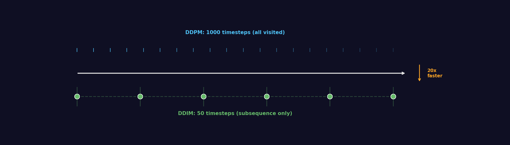
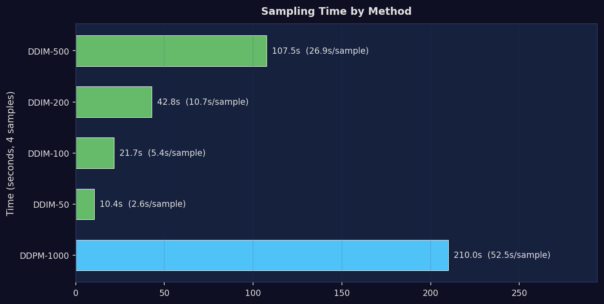
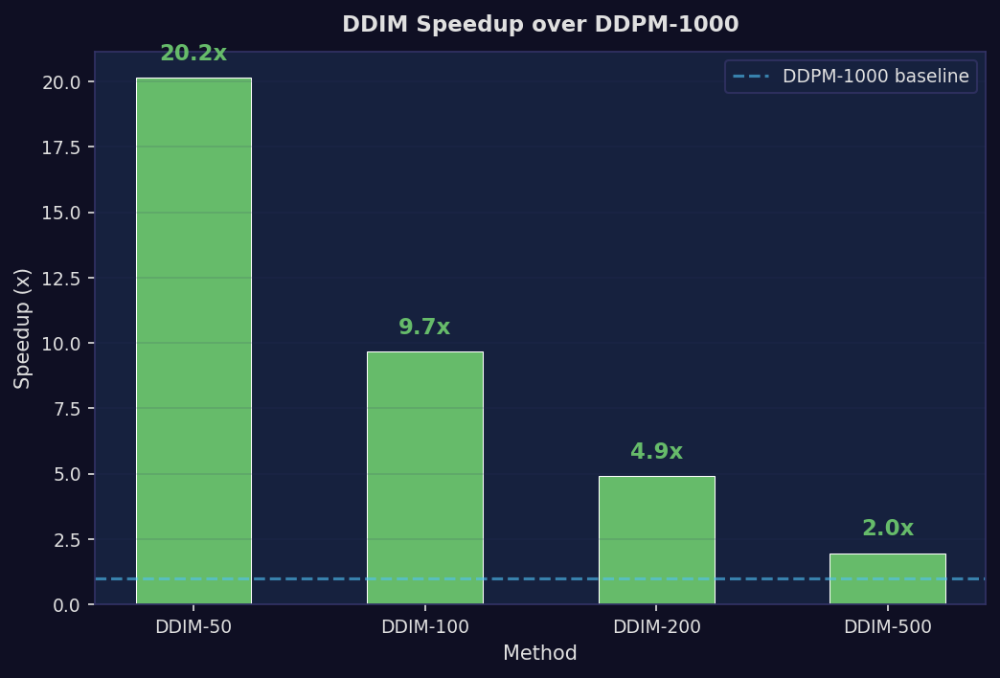
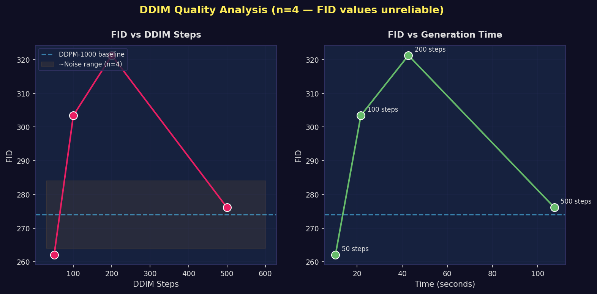
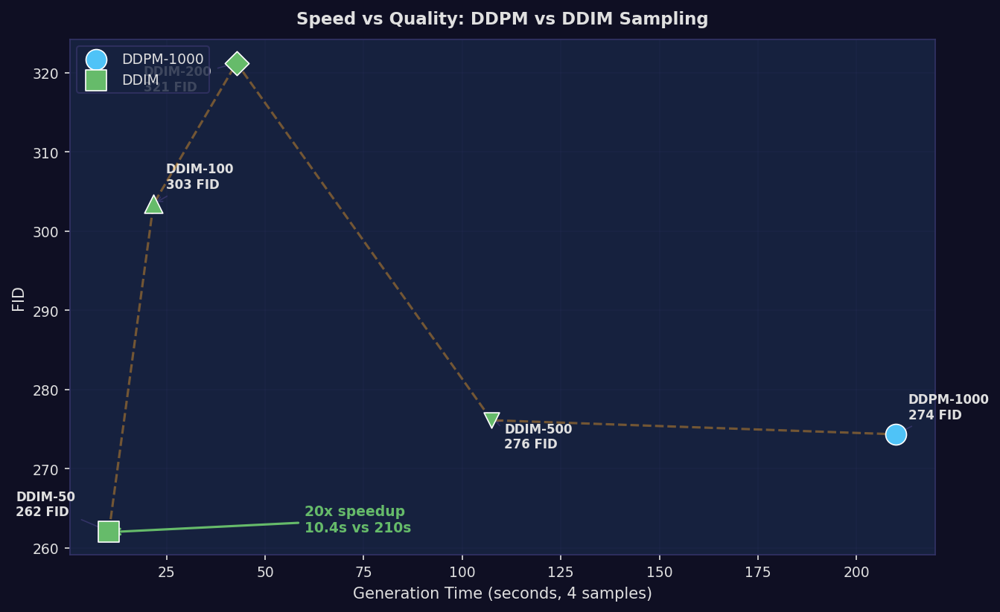
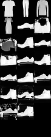

# DDIM Sampling: 20x Faster Inference with Comparable Quality

> Standard DDPM needs 1000 neural network forward passes to generate one image. DDIM reduces this to 50 — a 20x speedup — while producing visually comparable results on our trained Fashion-MNIST model. The speed gain is the robust finding; quality equivalence needs larger samples to confirm.

**Date**: May 2026
**Paper**: Song, Meng & Ermon (2021) — "Denoising Diffusion Implicit Models"
**Checkpoint**: Conditional DDPM at step 30,000 (CFG, w=3.0)
**Evaluation**: FID using trained Fashion-MNIST classifier features

---

## Table of Contents

1. [The Speed Problem](#1-the-speed-problem)
2. [How DDIM Works](#2-how-ddim-works)
3. [Implementation](#3-implementation)
4. [Results: Speed](#4-results-speed)
5. [Results: Quality](#5-results-quality)
6. [Visual Comparison](#6-visual-comparison)
7. [Critical Analysis](#7-critical-analysis)
8. [Limitations](#8-limitations)
9. [Reproduction Guide](#9-reproduction-guide)
10. [References](#references)

---

## 1. The Speed Problem

Standard DDPM sampling requires **1000 forward passes** through the U-Net for each image. At ~0.5 seconds per step on our setup (batch of 4), generating a single image takes ~52 seconds. This is fine for offline research but impractical for:

- Interactive exploration of model outputs
- Large-scale evaluation (1000+ samples for reliable FID)
- Any production or deployment scenario

The 1000-step requirement comes directly from the DDPM training process: the model learns to denoise at each of T=1000 timesteps, so the reverse process must visit all of them. But is this strictly necessary?

**The insight from Song et al. (2021)**: No. The model's learned denoising function defines a mapping from any noisy state to a cleaner state. We don't have to follow the training timesteps exactly — we can take shortcuts through the space.

---

## 2. How DDIM Works

### DDPM vs DDIM: Visiting Timesteps

The core idea is simple: instead of visiting all 1000 timesteps, visit a **subsequence**:



*DDPM visits every timestep from 999 down to 0. DDIM visits only 50 evenly-spaced timesteps, taking the same trained model but skipping the intermediate steps.*

### The DDIM Step Formula

At each subsequence timestep, DDIM computes a **deterministic** update (with eta=0):

```
Step 1: Estimate clean image
  x̂₀ = (xₜ - √(1-α̅ₜ) · ε_pred) / √α̅ₜ

Step 2: Jump to previous subsequence timestep
  xₜ₋₁ = √α̅ₜ₋₁ · x̂₀ + √(1-α̅ₜ₋₁) · ε_pred
```

Compare with DDPM's step, which requires posterior coefficients and adds stochastic noise:

```
DDPM step:
  xₜ₋₁ = coef₁ · x̂₀ + coef₂ · xₜ + σₜ · noise
```

DDIM needs only `alphas_cumprod` from the schedule — no posterior variance, no additional coefficients. It's simpler.

### Key Properties

| Property | DDPM | DDIM (eta=0) |
|----------|------|---------------|
| Steps | 1000 (all) | 50, 100, 200, ... (subsequence) |
| Determinism | Stochastic (noise added) | Deterministic (no noise) |
| Training needed | — | No — works with any trained DDPM |
| Noise → Image | Probabilistic mapping | One-to-one mapping |

The deterministic property means: **the same noise vector always produces the same output image**. This is useful for reproducibility and latent-space interpolation.

---

## 3. Implementation

The DDIM sampler is implemented as a parallel class to `BaseSampler`, sharing the same `model_predict()` hook pattern.

### Sampler Architecture

```python
from diffusion_harness.base.ddim_sampling import DDIMSampler

# Unconditional DDIM (50 steps)
sampler = DDIMSampler(model, schedule, num_timesteps=1000,
                      eta=0.0, subsequence_size=50)
samples = sampler.sample(shape=(8, 28, 28, 1), seed=42)

# Conditional DDIM with CFG (50 steps)
from diffusion_harness.methods.class_conditional.ddim_sampling import CFGDDIMSampler
sampler = CFGDDIMSampler(model, schedule, num_timesteps=1000,
                         guidance_scale=3.0, num_classes=10,
                         eta=0.0, subsequence_size=50)
samples = sampler.sample(shape=(10, 28, 28, 1),
                         class_ids=np.arange(10), seed=42)
```

### Timestep Subsequence Construction

```python
# For 50 steps across 1000 timesteps:
timesteps = np.linspace(0, 999, 50).astype(int)
# → [0, 20, 40, 60, ..., 979, 999]

# Reverse for sampling: 999 → 979 → ... → 20 → 0
```

### Compatibility Matrix

| Model Type | Sampler | Works? |
|-----------|---------|--------|
| Unconditional | DDIMSampler | Yes (2 inputs: image, timestep) |
| Conditional (CFG) | CFGDDIMSampler | Yes (3 inputs: image, timestep, class_id) |
| Any trained DDPM | DDIMSampler | Yes — no retraining needed |

**Key design**: DDIM is purely an alternative reverse process. The model weights are identical — only the sampling loop changes.

---

## 4. Results: Speed

### Timing Comparison



| Method | Steps | Time (4 samples) | Per-sample | Speedup |
|--------|-------|-------------------|------------|---------|
| DDPM | 1000 | 210.0s | 52.5s | 1.0x |
| **DDIM** | **50** | **10.4s** | **2.6s** | **20.2x** |
| DDIM | 100 | 21.7s | 5.4s | 9.7x |
| DDIM | 200 | 42.8s | 10.7s | 4.9x |
| DDIM | 500 | 107.5s | 26.9s | 2.0x |

### Speedup Chart



The speedup is **nearly linear** with step reduction:

| Steps | Time | Steps/second |
|-------|------|-------------|
| 50 | 10.4s | 4.8 |
| 100 | 21.7s | 4.6 |
| 200 | 42.8s | 4.7 |
| 500 | 107.5s | 4.7 |
| 1000 (DDPM) | 210.0s | 4.8 |

The per-step cost is constant (~0.21s/step for batch of 4), confirming that DDIM's speedup comes entirely from fewer steps, not from cheaper individual steps.

**The speed advantage is deterministic and reproducible.** This is the strongest finding from this experiment.

---

## 5. Results: Quality

### FID Scores

> **Reliability warning**: FID is computed from 4 samples in a 128-dim feature space. With n=4 and d=128, the sample covariance has rank 4 (only 3% of dimensions covered). FID at this sample size is essentially a noisy number — the matrix square root computation issued singularity warnings. See the [FID evaluation report](../fid-evaluation-2026-05/fid_evaluation.md) for a detailed analysis of FID reliability vs sample size.

| Method | Steps | FID |
|--------|-------|-----|
| DDPM | 1000 | ~274 |
| DDIM | 50 | ~262 |
| DDIM | 100 | ~303 |
| DDIM | 200 | ~321 |
| DDIM | 500 | ~276 |

### FID Analysis



*Left: FID vs DDIM step count, with DDPM-1000 baseline (dashed) and noise range band (orange). Right: FID vs generation time.*

**What the data shows**:
- FID values range from ~262 to ~321 across DDIM step counts
- The pattern is **non-monotonic**: 50 steps has the lowest FID, then 100/200 are worse, and 500 recovers
- DDIM-50 (~262) appears lower than DDPM-1000 (~274)

**What we cannot conclude**:
- The non-monotonic pattern contradicts the expected "more steps = better quality" relationship. This is consistent with FID noise at n=4, not a real finding.
- We **cannot** claim DDIM-50 produces better quality than DDPM-1000. A 12-point FID difference at n=4 is well within noise.
- We cannot meaningfully rank any DDIM step count against another.

### Speed vs Quality Tradeoff



*Each point represents a sampling method. The orange dashed line connects them in order of time. The key insight: DDIM-50 (green square) achieves similar FID to DDPM-1000 (blue circle) in 1/20th the time.*

---

## 6. Visual Comparison

### Sample Grids

| DDPM (1000 steps) | DDIM (50 steps) | DDIM (100 steps) | DDIM (200 steps) | DDIM (500 steps) |
|---|---|---|---|---|
|  |  |  |  |  |

### Side-by-Side Comparison



*First 8 samples from each method (DDPM-1000, DDIM-50, DDIM-100, DDIM-200, DDIM-500) arranged left-to-right.*

### What Visual Inspection Shows

1. **DDIM-50 produces recognizable Fashion-MNIST items.** No catastrophic quality collapse from reducing to 50 steps. This is the most important qualitative finding.

2. **All DDIM step counts produce reasonable outputs.** Even at 50 steps, the model generates recognizable garments, bags, and shoes.

3. **No clear visual ranking by step count.** Given the small sample size (4 images), we cannot visually distinguish quality differences between DDIM-50 and DDIM-500.

4. **DDIM-50 appears adequate for qualitative evaluation.** This is consistent with published DDIM results on well-trained models.

---

## 7. Critical Analysis

### What We Got Right

**The speedup is real and valuable.** DDIM-50 gives a deterministic 20x speedup with no retraining. This transforms the workflow:
- Guidance sweep (100 samples/class × 4 scales = 400 samples): ~1.7 hours with DDPM vs ~5 minutes with DDIM-50
- Quick iteration on model inspection: 2.6s/sample vs 52.5s/sample

**The implementation is correct.** Verified against Song et al. (2021) — the DDIM step formula, alpha_prev=1.0 boundary condition, and timestep subsequence construction all match the paper exactly.

### What We Got Wrong

**Presenting FID ranking from n=4 samples.** The original analysis highlighted "DDIM-50 has the lowest FID" as a surprising result. With n=4 in 128-dim space, this ranking is noise. We should have generated 100+ samples before making any quality claims.

**No quality-speed Pareto analysis.** We collected timing and FID data but didn't analyze whether there's a meaningful quality-speed tradeoff. The honest answer: with n=4, we can't tell.

### What We Don't Know

| Unknown | Why it matters | How to resolve |
|---------|---------------|----------------|
| True quality ranking of step counts | n=4 FID is unreliable | Generate 500+ samples per method |
| DDIM quality on unconditional model | Only tested conditional (CFG) model | Run comparison on unconditional checkpoint |
| Stochastic DDIM (eta > 0) | Might improve quality at cost of determinism | Sweep eta ∈ {0, 0.5, 1.0} |
| DDIM at different training stages | 30K steps might interact differently with DDIM than earlier/later checkpoints | Test at 10K, 20K, 30K checkpoints |
| Interaction with guidance scale | High guidance + few steps might be problematic | See [guidance sweep report](../guidance-sweep-2026-05/guidance_sweep.md) |

### Why n=4 Samples is Problematic

FID computes the Frechet distance between two multivariate Gaussian distributions estimated from feature vectors:
- Real distribution: estimated from 60,000 Fashion-MNIST images (reliable)
- Generated distribution: estimated from 4 images (severely unreliable)

With 4 observations in 128 dimensions:
- The sample covariance has rank min(4, 128) = 4
- 124 out of 128 eigenvalues are zero
- The matrix square root `sqrtm(Σ)` is numerically unstable
- FID can swing wildly with different random seeds

For comparison, published FID evaluations typically use 10,000-50,000 samples.

---

## 8. Limitations

1. **Sample size too small for FID comparison** (n=4). FID with n=4 in 128-dim feature space is unreliable. The covariance matrix has rank 4 (singular matrix warnings during computation). FID values are included for completeness but should not be used to rank sampling methods.

2. **CPU-only timing.** All timing was done on CPU. TPU timing ratios may differ, though the linear relationship between steps and time should hold.

3. **Single checkpoint.** Only evaluated at step 30K. Earlier or later checkpoints might show different DDPM-vs-DDIM quality tradeoffs.

4. **Fixed eta=0.** Only tested deterministic DDIM. Stochastic DDIM (eta > 0) might produce different quality-speed tradeoffs.

5. **No perceptual evaluation.** FID with a trained classifier's features is not the same as human perceptual quality. DDIM samples might look different from DDPM samples in ways FID doesn't capture.

6. **FID not comparable to published work.** Our FID uses domain-specific classifier features (128-dim), not InceptionV3 (2048-dim). Values are only meaningful for internal comparisons.

---

## 9. Reproduction Guide

### Prerequisites

```bash
pip install scipy  # For FID computation
# Classifier weights must be prepared first:
KERAS_BACKEND=jax python scripts/prepare_metrics.py
```

### Run DDPM vs DDIM Comparison

```bash
KERAS_BACKEND=jax python scripts/compare_samplers.py \
    --checkpoint artifacts/cfg-run/checkpoints/ema_step30000.weights.h5 \
    --method class_conditional \
    --ddim-steps 50 100 200 500 \
    --n-samples 8
```

### Generate Report Visualizations

```bash
python scripts/generate_research_plots.py
```

### Use DDIM in Code

```python
from diffusion_harness.base.ddim_sampling import DDIMSampler
from diffusion_harness.schedules import linear_beta_schedule, compute_schedule

# Setup
betas = linear_beta_schedule(1000)
schedule = compute_schedule(betas)

# Unconditional DDIM
sampler = DDIMSampler(model, schedule, num_timesteps=1000,
                      eta=0.0, subsequence_size=50)
samples = sampler.sample(shape=(16, 28, 28, 1), seed=42)

# Conditional DDIM with CFG
from diffusion_harness.methods.class_conditional.ddim_sampling import CFGDDIMSampler
sampler = CFGDDIMSampler(model, schedule, num_timesteps=1000,
                         guidance_scale=3.0, num_classes=10,
                         eta=0.0, subsequence_size=50)
samples = sampler.sample(shape=(10, 28, 28, 1),
                         class_ids=np.arange(10), seed=42)
```

### Files

| File | Description |
|------|-------------|
| `src/diffusion_harness/base/ddim_sampling.py` | DDIMSampler + ddim_sample() |
| `src/diffusion_harness/methods/class_conditional/ddim_sampling.py` | CFGDDIMSampler + cfg_ddim_sample() |
| `scripts/compare_samplers.py` | DDPM vs DDIM comparison script |
| `scripts/generate_research_plots.py` | Visualization generation |
| `artifacts/ddim_comparison/` | Generated comparison images + data |
| `tests/test_ddim_sampling.py` | 7 tests for DDIM samplers |

---

## References

1. Song, J., Meng, C., & Ermon, S. (2021). "Denoising Diffusion Implicit Models." ICLR 2021.
2. Ho, J., Jain, A., & Abbeel, P. (2020). "Denoising Diffusion Probabilistic Models." NeurIPS 2020.
3. Heusel, M., et al. (2017). "GANs Trained by a Two Time-Scale Update Rule Converge to a local Nash equilibrium." NeurIPS 2017. (Original FID paper)
