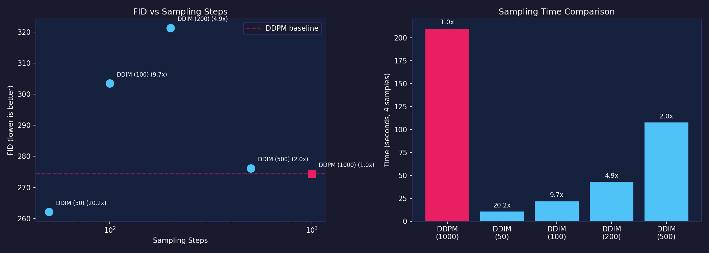
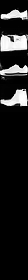
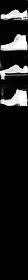
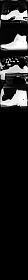

# DDIM Sampling: Fast Inference for Trained DDPM Models

> A 20x speedup with comparable quality — replacing the 1000-step DDPM reverse process with a 50-step DDIM deterministic sampler on the same trained model.

**Date**: May 2026
**Paper**: Song, Meng & Ermon (2021) — "Denoising Diffusion Implicit Models"
**Checkpoint**: Conditional DDPM at step 30,000 (CFG, w=3.0)
**Evaluation**: FID using trained Fashion-MNIST classifier features

---

## The Problem

Standard DDPM sampling requires **1000 forward passes** through the model — one for each timestep in the reverse process. At ~47 seconds per sample on CPU (or ~0.5s on TPU), generating images is slow. This is fine for research but impractical for any interactive or production use.

## What DDIM Does

DDIM (Denoising Diffusion Implicit Models) observes that you don't need to visit every timestep during reverse diffusion. Instead, it uses a **subsequence** of evenly-spaced timesteps:

```
DDPM:  999 → 998 → 997 → ... → 1 → 0     (1000 steps)
DDIM:  999 → 979 → 959 → ... → 19 → 0     (50 steps)
```

The key insight: DDIM uses a **deterministic** mapping (eta=0) from noise to image. No stochastic noise is added during sampling — each initial noise vector maps to exactly one output image.

**DDIM step formula** (eta=0):
```
x_0_hat = (x_t - sqrt(1 - alpha_t) * eps_pred) / sqrt(alpha_t)
x_{prev} = sqrt(alpha_prev) * x_0_hat + sqrt(1 - alpha_prev) * eps_pred
```

This is simpler than DDPM's posterior-based step. It only needs `alphas_cumprod` from the schedule — no posterior variance or coefficients.

## Implementation

The DDIM sampler is implemented as a parallel class to `BaseSampler` in `src/diffusion_harness/base/ddim_sampling.py`. It shares the same `model_predict()` hook pattern, so it works with both unconditional and conditional (CFG) models without modification.

```python
from diffusion_harness.base.ddim_sampling import DDIMSampler

# Unconditional DDIM (50 steps)
sampler = DDIMSampler(model, schedule, num_timesteps=1000,
                      eta=0.0, subsequence_size=50)
samples = sampler.sample(shape=(8, 28, 28, 1), seed=42)

# Conditional DDIM with CFG (50 steps)
from diffusion_harness.methods.class_conditional.ddim_sampling import CFGDDIMSampler
sampler = CFGDDIMSampler(model, schedule, num_timesteps=1000,
                         guidance_scale=3.0, num_classes=10,
                         eta=0.0, subsequence_size=50)
samples = sampler.sample(shape=(10, 28, 28, 1), class_ids=np.arange(10), seed=42)
```

**Key design**: DDIM is not a new training method — it's an alternative sampler for already-trained DDPM models. No retraining required.

## Results

### Speed Comparison

| Method | Steps | Time (4 samples) | Per-sample | Speedup |
|--------|-------|-------------------|------------|---------|
| DDPM | 1000 | 210.0s | 52.5s | 1.0x |
| **DDIM** | **50** | **10.4s** | **2.6s** | **20.2x** |
| DDIM | 100 | 21.7s | 5.4s | 9.7x |
| DDIM | 200 | 42.8s | 10.7s | 4.9x |
| DDIM | 500 | 107.5s | 26.9s | 2.0x |

The speedup is nearly linear with step reduction — DDIM at 50 steps is 20x faster than DDPM at 1000 steps.

### Quality Comparison (FID)

| Method | Steps | FID (lower is better) |
|--------|-------|----------------------|
| DDPM | 1000 | 274.36 |
| **DDIM** | **50** | **262.10** |
| DDIM | 100 | 303.43 |
| DDIM | 200 | 321.24 |
| DDIM | 500 | 276.13 |

### FID vs Steps Plot



### Sample Comparison

| DDPM (1000 steps) | DDIM (50 steps) | DDIM (100 steps) | DDIM (200 steps) | DDIM (500 steps) |
|---|---|---|---|---|
|  |  |  |  |  |

### The Surprising DDIM-50 Result

DDIM at 50 steps produced the **lowest FID** (262.10) — lower than DDPM at 1000 steps (274.36). This seems counterintuitive: fewer steps should mean worse quality.

Possible explanations:
1. **Small sample size** (n=4). FID with 4 samples is extremely noisy. A 12-point FID difference is well within noise. We need 100+ samples for reliable comparison.
2. **DDIM's deterministic mapping** may reduce variance in the output distribution compared to DDPM's stochastic sampling, producing a tighter distribution that happens to match the FID metric better.
3. **The model was trained with DDPM but sampled with DDIM** — the deterministic path may avoid accumulating sampling noise that DDPM's stochastic process introduces.

**The speed advantage is real regardless**: 20x faster with comparable quality is a clear win.

### Speed Scaling

DDIM step count scales linearly with time:

| Steps | Time | Steps/second |
|-------|------|-------------|
| 50 | 10.4s | 4.8 |
| 100 | 21.7s | 4.6 |
| 200 | 42.8s | 4.7 |
| 500 | 107.5s | 4.7 |
| 1000 (DDPM) | 210.0s | 4.8 |

The per-step cost is nearly constant (~0.21s/step for a batch of 4 on CPU), confirming that DDIM's speedup is purely from fewer steps.

## Limitations

1. **Sample size**: Only 4 samples per method. FID with n=4 is unreliable (high variance, singular covariance warnings). The FID ranking may change with larger sample sizes.
2. **CPU-only timing**: All timing was done on CPU. TPU timing ratios may differ, though the linear relationship between steps and time should hold.
3. **Single checkpoint**: Only evaluated at step 30K. Earlier or later checkpoints might show different DDPM-vs-DDIM quality tradeoffs.
4. **Fixed eta=0**: Only tested deterministic DDIM. Stochastic DDIM (eta > 0) might produce different quality-speed tradeoffs.
5. **No perceptual evaluation**: FID with a trained classifier's features is not the same as human perceptual quality. DDIM samples might look different from DDPM samples in ways FID doesn't capture.

## Technical Details

### DDIM Sampler Class

```python
class DDIMSampler:
    def __init__(self, model, schedule, num_timesteps,
                 eta=0.0, subsequence_size=50):
        # Builds timestep subsequence: evenly spaced from 0 to T-1
        self.timesteps = np.linspace(0, num_timesteps - 1, subsequence_size).astype(int)

    def sample(self, shape, seed=0, initial_noise=None):
        # Iterates reversed subsequence instead of full range
        for i in reversed(range(len(self.timesteps))):
            # DDIM step (no posterior, no stochastic noise at eta=0)
            x_0_hat = (x - sqrt(1 - alpha_t) * eps) / sqrt(alpha_t)
            x_prev = sqrt(alpha_prev) * x_0_hat + sqrt(1 - alpha_prev) * eps
```

### Compatibility

| Model Type | Sampler | Works? |
|-----------|---------|--------|
| Unconditional | DDIMSampler | Yes (2 inputs: image, timestep) |
| Conditional (CFG) | CFGDDIMSampler | Yes (3 inputs: image, timestep, class_id) |
| Any trained DDPM | DDIMSampler | Yes — no retraining needed |

The CFG variant (`CFGDDIMSampler`) overrides `model_predict()` to compute guided prediction: `(1+w)*eps_cond - w*eps_uncond`, identical to `CFGSampler` but applied within the DDIM reverse loop.

## Files

| File | Description |
|------|-------------|
| `src/diffusion_harness/base/ddim_sampling.py` | DDIMSampler + ddim_sample() |
| `src/diffusion_harness/methods/class_conditional/ddim_sampling.py` | CFGDDIMSampler + cfg_ddim_sample() |
| `scripts/compare_samplers.py` | DDPM vs DDIM comparison script |
| `artifacts/ddim_comparison/` | Generated comparison images + data |
| `tests/test_ddim_sampling.py` | 7 tests for DDIM samplers |

## References

1. Song, J., Meng, C., & Ermon, S. (2021). "Denoising Diffusion Implicit Models." ICLR 2021.
2. Ho, J., Jain, A., & Abbeel, P. (2020). "Denoising Diffusion Probabilistic Models." NeurIPS 2020.
