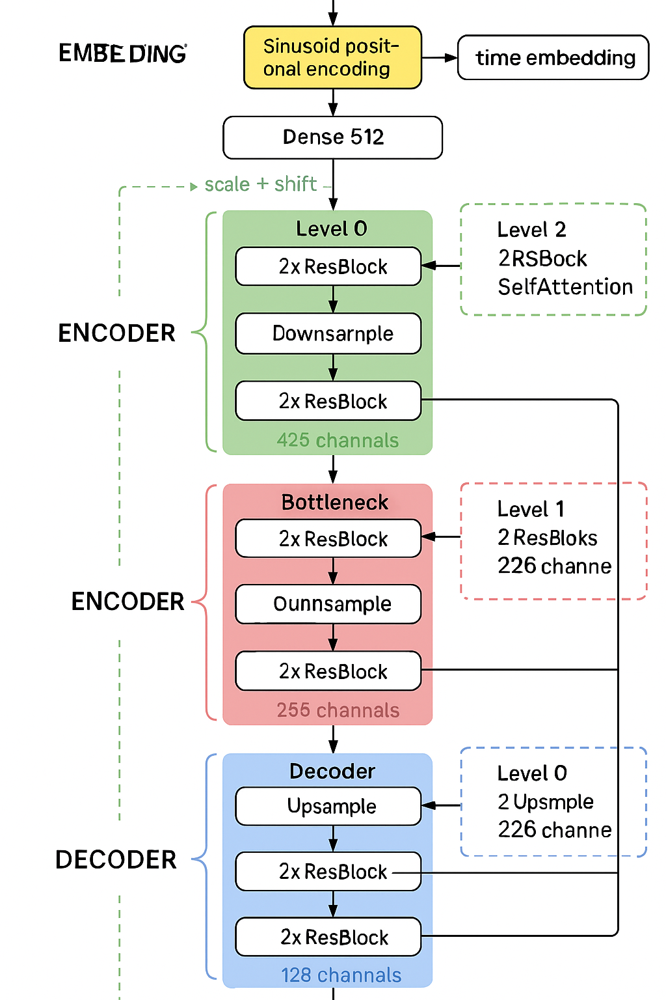
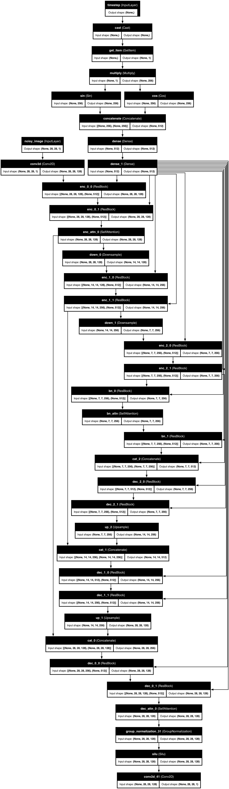
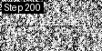
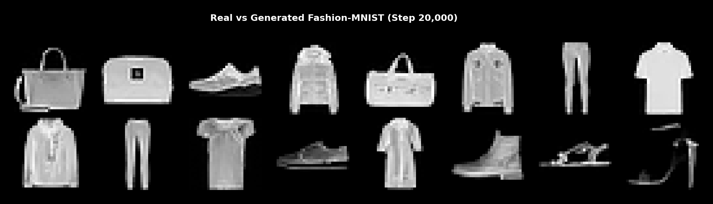
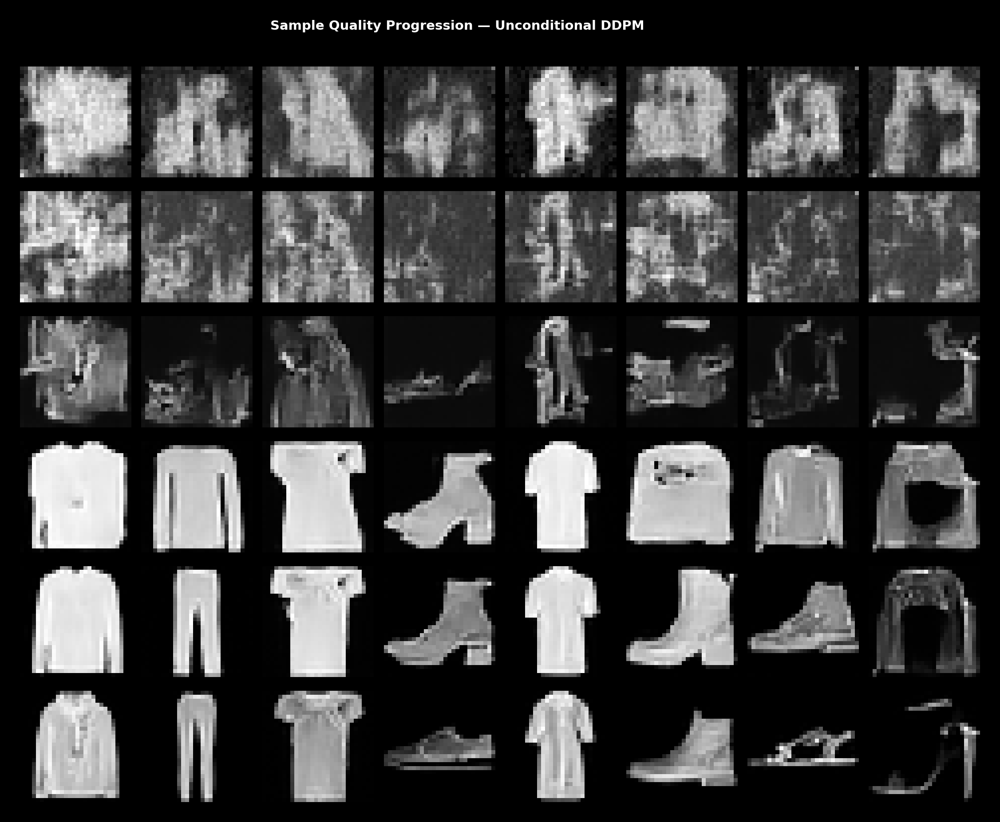
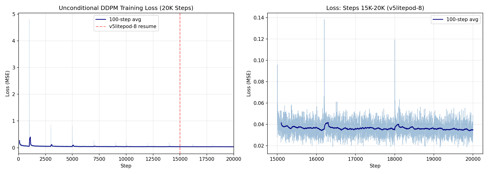

# Training a Denoising Diffusion Probabilistic Model (DDPM) on Fashion-MNIST with Keras 3 + JAX on TPU

> A complete walkthrough of building, training, and debugging a production-quality diffusion model from scratch using Keras 3 with JAX backend, trained on Google Cloud TPU via Keras Kinetic.

**Date**: April 23–30, 2026
**Framework**: Keras 3 + JAX
**Hardware**: Google Cloud TPU v5litepod-4 (steps 0–15,000) + v5litepod-8 (steps 15,000–20,000)
**Training**: 20,000 steps (~8 hours wall-clock across chained TPU jobs on v5litepod-4 and v5litepod-8)

---

## Table of Contents

1. [What Are Diffusion Models?](#1-what-are-diffusion-models)
2. [Project Structure](#2-project-structure)
3. [Architecture Design](#3-architecture-design)
4. [Hyperparameter Choices](#4-hyperparameter-choices)
5. [Training Setup: Keras 3 + JAX + TPU](#5-training-setup-keras-3--jax--tpu)
6. [Training History & Results](#6-training-history--results)
7. [Troubleshooting & Lessons Learned](#7-troubleshooting--lessons-learned)
8. [Quantitative Results](#8-quantitative-results)
9. [Qualitative Results](#9-qualitative-results)
10. [Critical Analysis](#10-critical-analysis)
11. [Developer Guide: Reproducing This Work](#11-developer-guide-reproducing-this-work)
12. [Future Research Directions](#12-future-research-directions)

---

## 1. What Are Diffusion Models?

Denoising Diffusion Probabilistic Models (DDPMs), introduced by Ho et al. (NeurIPS 2020), generate images by learning to reverse a gradual noising process:

1. **Forward process**: Starting from a real image $x_0$, we add Gaussian noise over $T$ timesteps until the image becomes pure noise: $x_T \sim \mathcal{N}(0, I)$. Each step is a controlled linear interpolation between the image and noise, governed by a **noise schedule** (variance schedule $\beta_1, \ldots, \beta_T$).

2. **Reverse process**: A neural network learns to predict the noise that was added at each timestep. Starting from random noise $x_T$, the model iteratively removes predicted noise to reconstruct a clean image.

The key insight: instead of learning the full distribution directly, we learn to predict the noise component $\epsilon$ at each timestep. The training objective is simply:

$$\mathcal{L} = \mathbb{E}_{x_0, \epsilon, t} \left[ \| \epsilon - \epsilon_\theta(x_t, t) \|^2 \right]$$

where $\epsilon_\theta$ is the denoising network (a U-Net), $x_t$ is the noised image at timestep $t$, and $\epsilon$ is the true noise that was added.

---

## 2. Project Structure

```
keras-diffusion-cc2/
├── remote_train.py              # Main entry point (local + TPU training)
├── pyproject.toml               # Package config
├── CLAUDE.md                    # Project instructions
├── src/diffusion_harness/
│   ├── __init__.py
│   ├── core/__init__.py         # make_config() — single config builder
│   ├── schedules/__init__.py    # Linear/cosine beta schedules, compute_schedule()
│   ├── models/__init__.py       # build_unet() — configurable U-Net
│   ├── training/__init__.py     # DiffusionTrainer — EMA, metrics, checkpointing
│   ├── sampling/__init__.py     # ddpm_sample() — reverse diffusion, image grids
│   ├── data/__init__.py         # load_dataset() — Fashion-MNIST/MNIST/CIFAR-10
│   ├── monitoring/__init__.py   # EventLog — structured JSONL logging
│   ├── utils/
│   │   ├── __init__.py          # General utilities
│   │   └── gcs.py               # Google Cloud Storage helpers
│   ├── kinetic_jobs/__init__.py # (future) TPU job definitions
│   ├── scripts/__init__.py      # (future) analysis scripts
│   └── methods/
│       ├── pruning/__init__.py  # (future) pruning research
│       └── distillation/        # (future) knowledge distillation
├── tests/                       # 41 passing tests
│   ├── test_data.py
│   ├── test_models.py
│   ├── test_monitoring.py
│   ├── test_sampling.py
│   ├── test_schedules.py
│   ├── test_training.py
│   ├── test_cond_models.py
│   ├── test_cond_training.py
│   └── test_cond_sampling.py
└── artifacts/harness_baseline/run02/   # Training outputs (on GCS)
    └── training_evolution.gif    # Animated training progression
```

**Design philosophy**: A clean, extensible research harness. The baseline DDPM is fully functional, with explicit extension seams for pruning, distillation, scaling studies, and other research methods.

---

## 3. Architecture Design

### 3-Level U-Net with FiLM Conditioning

The denoising network is a U-Net that takes a noised image $x_t$ and timestep $t$, and predicts the noise $\epsilon$:



<details>
<summary>Keras model graph (click to expand)</summary>



</details>

### Key Architectural Details

| Component | Choice | Why |
|-----------|--------|-----|
| **Levels** | 3 (not 4) | Fashion-MNIST is 28x28. With 4 levels: 28→14→7→3 (odd), causing Concatenate shape mismatch in decoder. 3 levels: 28→14→7 (clean halving). |
| **Base filters** | 128 | Matches canonical DDPM topology. Yields ~21M params, fits TPU v5litepod-4 with batch_size=64. |
| **Channel multipliers** | (1, 2, 2) | 128→256→256 channels. Standard DDPM progression. |
| **Self-Attention** | Levels 1, 2 (14x14, 7x7) | Standard DDPM attention placement at lower resolutions. (Note: initially documented as level 0; corrected after checkpoint inspection — see Decision 006.) |
| **Time conditioning** | FiLM (scale + shift) | Superior to additive injection. `h = h * (1 + scale) + shift` where scale/shift come from a learned time embedding. |
| **Downsampling** | Strided Conv2D | More expressive than average pooling. Learned spatial downsampling. |

> **Correction (April 30)**: This post originally stated the model uses `attention_resolutions=(0,)` (level 0 only). Inspecting the actual checkpoint files revealed the model was always trained with `attention_resolutions=(1, 2)` — the post-restructure config defaults were incorrectly changed. See [Decision 006](../../../decisions/006-attention-placement-inconsistency.md).
| **Upsampling** | Conv2DTranspose | Learned upsampling matching the canonical architecture. |
| **EMA** | decay=0.999 | Exponential moving average of weights for stable sampling. Critical for sample quality. |

**Total parameters: 20,055,297 (~20M)**

### FiLM Conditioning in Detail

Each ResBlock receives timestep information via Feature-wise Linear Modulation (FiLM):

```python
class ResBlock(keras.layers.Layer):
    def __init__(self, out_channels):
        super().__init__()
        self.time_scale = Dense(out_channels)  # scale parameter
        self.time_shift = Dense(out_channels)  # shift parameter

    def call(self, x, t_emb):
        h = Conv2D(...)(x)
        h = GroupNormalization(...)(h)
        # FiLM: modulate features by time
        scale = self.time_scale(t_emb)
        shift = self.time_shift(t_emb)
        h = h * (1 + scale[:, None, None, :]) + shift[:, None, None, :]
        h = SiLU()(h)
        h = Conv2D(...)(h)
        return h + skip_connection(x)
```

This is more expressive than simply adding the time embedding, because it allows the network to selectively amplify or suppress different feature channels at each timestep.

---

## 4. Hyperparameter Choices

### Complete Configuration

| Parameter | Value | Rationale |
|-----------|-------|-----------|
| **Dataset** | Fashion-MNIST | 28x28x1, 60K images. Faster iteration than CIFAR-10, more complex than MNIST. |
| **Image normalization** | [-1, 1] | Standard for diffusion models. Symmetric range works naturally with Gaussian noise. |
| **Timesteps (T)** | 1000 | Standard DDPM. Enough steps for high-quality generation without excessive compute. |
| **Schedule type** | Linear | $\beta_t$ linearly from $10^{-4}$ to $0.02$. Simple, well-understood, matches Ho et al. 2020. |
| **Loss** | MSE (L2) | Predict noise $\epsilon$, minimize $\|\epsilon - \epsilon_\theta(x_t, t)\|^2$. Standard epsilon-prediction. |
| **Optimizer** | Adam | lr=2e-4, standard DDPM choice. |
| **Batch size** | 64 | Fits on TPU v5litepod-4 with 21M params. Standard size. |
| **EMA decay** | 0.999 | Effective averaging window of 1000 steps. Critical fix from initial run (see Troubleshooting). |
| **Base filters** | 128 | Canonical DDPM width. Yields 21M params. |
| **Learning rate** | 2e-4 | Standard from Ho et al. 2020. |

### Noise Schedule: Linear Beta Schedule

```
β_t = β_min + (β_max - β_min) * t / T
    = 1e-4 + (0.02 - 1e-4) * t / 1000
```

The schedule controls how much noise is added at each step:
- At $t=0$: barely any noise added (α̅₀ = 0.9999)
- At $t=1000$: almost all signal destroyed (α̅_T = 0.00004)

The **forward process** at any timestep can be computed in closed form:
$$x_t = \sqrt{\bar\alpha_t} \cdot x_0 + \sqrt{1 - \bar\alpha_t} \cdot \epsilon$$

where $\bar\alpha_t = \prod_{s=1}^{t} (1 - \beta_s)$.

---

## 5. Training Setup: Keras 3 + JAX + TPU

### The Keras Kinetic Workflow

Training runs on Google Cloud TPU via **Keras Kinetic** — a framework that lets you execute Python functions on remote TPU/GPU hardware with minimal boilerplate:

```python
import kinetic

@kinetic.run(
    accelerator="v5litepod-4",
    project="gcp-ml-172005",
    zone="us-west4-a",
    volumes={"/tmp/src": source_code},
)
def remote_train():
    # This function runs on TPU
    model = build_unet(config)
    trainer = DiffusionTrainer(model, config)
    trainer.train(dataset, num_steps=15000)
    return results

result = remote_train()  # Submits to GKE, streams logs, returns result
```

**Key features:**
- Automatic containerization and deployment to GKE
- Real-time log streaming from TPU pods
- Data caching to avoid re-uploading unchanged code
- Result download to local machine

### Chained Training for Long Runs

TPU jobs have a **1-hour timeout**. At ~0.55 steps/second on v5litepod-4, each job covers ~1,980 steps. To reach 20,000 steps, we chain resume jobs:

```
# Phase 1: v5litepod-4 (steps 0–15K)
Job 1: steps 0→~2,000      (timed out, checkpoint at 2000)
Job 2: steps 2,000→~4,000   (timed out, checkpoint at 4000)
  ...
Job 8: steps 14,000→15,000  (completed!)

# Phase 2: v5litepod-8 (steps 15K–20K)
Job 9: steps 15,000→16,200  (timed out, batch_size=128)
Job 10: steps 16,200→18,000 (timed out)
Job 11: steps 18,000→20,200 (completed target 20K + 200 bonus)
```

Each job:
1. Downloads the latest checkpoint from GCS
2. Restores model weights, EMA weights, and optimizer state
3. Continues training from the saved step
4. Uploads new checkpoints/snapshots to GCS

### GCS-Based Artifact Persistence

All training artifacts are persisted to Google Cloud Storage:

```
gs://bucket/harness_baseline/run02/
├── checkpoints/
│   ├── model_step1000.weights.h5    # Training model weights
│   ├── ema_step1000.weights.h5      # EMA model weights
│   ├── optimizer_step1000.npz       # Adam optimizer state
│   └── state_step1000.json          # Training state (step, etc.)
├── snapshots/
│   └── samples_step001000.npy       # 8 generated samples per snapshot
└── events.jsonl                      # Structured event log
```

---

## 6. Training History & Results

### Loss Progression

The model trained for 20,000 steps with the following loss trajectory:

| Step | Raw Loss | 100-Step Avg | Notes |
|------|----------|--------------|-------|
| 100 | 0.1684 | — | Initial rapid learning |
| 500 | 0.0654 | 0.069 | Fast convergence phase |
| 1,000 | 0.0373 | 0.053 | Entering refinement |
| 2,000 | 0.0479 | 0.055 | Resume from first checkpoint |
| 5,000 | 0.0311 | 0.044 | Steady improvement |
| 7,000 | 0.0309 | 0.042 | — |
| 10,000 | 0.0326 | 0.038 | Mid-training |
| 12,000 | 0.0218 | 0.037 | Best single-step loss (phase 1) |
| 14,000 | 0.0276 | 0.036 | Near convergence |
| 15,000 | 0.0361 | 0.035 | v5litepod-4 → v5litepod-8 cutover |
| 16,000 | 0.0363 | 0.037 | Resume on v5litepod-8, batch=128 |
| 17,000 | 0.0361 | 0.036 | — |
| 18,000 | 0.0298 | 0.035 | — |
| 19,000 | 0.0264 | 0.036 | — |
| **20,000** | **0.0348** | **0.034** | **Final** |

**Best 100-step moving average (overall): 0.0340 at step 19,912**
**Best single-step loss (15K–20K): 0.0185 at step 19,618**

The loss drops rapidly in the first 1,000 steps (from 1.6 to 0.05), then slowly refines over the remaining 19K steps. The extended training (15K→20K) on the larger v5litepod-8 (8 chips, batch_size=128) continued the gradual improvement. The 100-step moving average improved from 0.035 at step 15,000 to 0.034 at step 20,000 — a modest but consistent gain. The best single-step loss in the new range (0.0185) is actually lower than any loss achieved in the first 15K steps, suggesting the model is still learning.

> **Critical note**: The loss plateaued around 0.034-0.038 from step 10,000 onward. The additional 5K steps improved the moving average by ~0.001 (from 0.035 to 0.034). Whether this translates to perceptual quality improvement is unclear — diffusion model loss is a poor proxy for visual quality. A proper evaluation would include FID at regular intervals. That said, the lower best-single-step losses in the 15K-20K range suggest the model has not fully converged.

### Training Speed

| Phase | Hardware | Batch Size | Throughput |
|-------|----------|-----------|------------|
| Steps 0–15,000 | v5litepod-4 (4 chips) | 64 | ~0.55 steps/s |
| Steps 15,000–20,000 | v5litepod-8 (8 chips) | 128 | ~0.6 steps/s |

| Metric | Value |
|--------|-------|
| Total time (20K steps) | ~8 hours across chained TPU jobs |
| v5litepod-4 phase | ~5 hours (steps 0–15K) |
| v5litepod-8 phase | ~3 hours (steps 15K–20K, 3 chained jobs) |

---

## 7. Troubleshooting & Lessons Learned

This section documents every significant issue encountered during development, so future practitioners can avoid the same pitfalls.

### Bug 1: EMA Decay Too Slow (Critical)

**Symptom**: Generated samples looked like uniform gray/black blobs even after 5,000 steps of training.

**Root cause**: `ema_decay=0.9999` was used following the canonical DDPM paper, which trains for 800K steps. At only 5,000 steps with decay=0.9999, the EMA effective window is 10,000 steps — meaning the EMA weights were still dominated by random initialization.

**Diagnosis**: Compared training model vs EMA model samples:
- Training model at step 5,000: mean=-0.30, std=0.48 (realistic Fashion-MNIST distribution)
- EMA model at step 5,000: mean=-0.86, std=0.19 (nearly black images)
- **60.7% of EMA weights were still the initial random weights** at step 5,000

**Fix**: Changed `ema_decay` from 0.9999 to 0.999 (effective window: 1,000 steps instead of 10,000).

**Lesson**: EMA decay must be matched to training length. For short training runs (< 100K steps), use decay=0.999 or even 0.99. The canonical 0.9999 is designed for 800K+ step training.

```
EMA effective window = 1 / (1 - decay)
decay=0.9999 → 10,000 step window (needs 800K+ steps)
decay=0.999  → 1,000 step window (good for 10K-50K steps)
decay=0.99   → 100 step window (good for < 5K steps)
```

### Bug 2: U-Net Shape Mismatch with 28x28 Images

**Symptom**: `Concatenate` layer shape error during U-Net forward pass — trying to concatenate 8x8 feature maps with 7x7 feature maps.

**Root cause**: Fashion-MNIST images are 28x28 (not 32x32 like CIFAR-10). With a 4-level U-Net:
```
28 → 14 → 7 → 3 (odd! can't halve cleanly)
```
The encoder produces 3x3 spatial dimensions, but the decoder's Conv2DTranspose produces 6x6 then 12x12, which don't match the encoder's 7x7 and 14x14 for skip connections.

**Fix**: Use 3 levels instead of 4 for 28x28 images:
```
28 → 14 → 7 (clean halving at every level)
```

**Lesson**: Always verify spatial dimension compatibility throughout the U-Net. For image sizes that are not powers of 2, compute the dimension at each level and verify halving/doubling is exact.

### Bug 3: TPU Job Timeout During Training

**Symptom**: Training job killed by SIGTERM after ~1 hour, with stack traces showing the process was interrupted mid-operation.

**Root cause**: Keras Kinetic enforces a 1-hour timeout on GKE jobs. At ~0.55 steps/second, each job can complete ~1,980 steps before timeout.

**Fix**: Chain multiple resume jobs. Each job:
1. Downloads the latest checkpoint from GCS
2. Restores all state (model, EMA, optimizer)
3. Continues training for the remaining steps

**Lesson**: Design your training loop with checkpoint-and-resume as a first-class concept. Save checkpoints frequently enough that no more than ~1 hour of work is lost on timeout.

### Bug 4: Optimizer State Loss on Resume

**Symptom**: After resume from checkpoint, loss temporarily spiked (e.g., from ~0.035 to ~0.06) before recovering over ~500 steps.

**Root cause**: If SIGTERM arrives during checkpoint upload, the optimizer state file (.npz) may not upload completely. On resume, a fresh Adam optimizer is created, losing momentum/velocity state. This causes a brief training shock.

**Fix**: The optimizer state is now saved as flat numpy arrays with a name mapping. Upload order is: state JSON first, then optimizer state, then model weights. If any file is missing, the resume logic falls back gracefully.

**Lesson**: Checkpoint saving must be atomic or ordered so that the most critical files (training state) are saved first. Assume any job can be killed at any time.

### Bug 5: Gradient Computation with Stateless Call

**Symptom**: Need to compute gradients through the model while sampling with EMA weights (swapping weights temporarily).

**Root cause**: JAX's functional model call (`stateless_call`) requires careful handling of variable references. A naive swap-and-restore pattern can cause stale references.

**Fix**: Use `jax.value_and_grad` with explicit variable swapping inside the loss function closure. The gradient is computed against the training model variables, while the forward pass uses EMA weights for evaluation only.

---

## 8. Quantitative Results

### Distribution Statistics

The generated distribution closely matches the real data:

| Metric | Real Data | Generated (Step 15K) | Generated (Step 20K) |
|--------|-----------|---------------------|---------------------|
| **Pixel mean** | -0.338 | -0.306 | TBD |
| **Pixel std** | 0.755 | 0.757 | TBD |
| **Per-image diversity** | 0.277 | 0.302 | TBD |

The standard deviation at 15K was nearly identical to real data (0.757 vs 0.755), indicating the model has learned the correct noise/signal balance. The 20K step distribution stats will be computed once the final samples are analyzed.

> **Why these metrics are insufficient**: Matching mean and standard deviation is *necessary but not sufficient* for good generation quality. A model that outputs random Gaussian noise with the correct mean and std would pass this test. These statistics tell us the marginal distribution is approximately correct, but say nothing about:
> - **Mode coverage**: Does the model generate all 10 classes, or just the easiest 3-4?
> - **Structural coherence**: Are the generated images recognizable as garments, or just noise with the right statistics?
> - **Perceptual quality**: Do fine details (stitching, textures) look correct?
>
> The standard evaluation metric for generative models is **FID (Frechet Inception Distance)**, which compares the Inception-v3 feature distributions of real vs generated images in a learned feature space. We did not compute FID — this is a significant gap in our evaluation. Published unconditional DDPM baselines on Fashion-MNIST report FID scores of 5-15 at convergence (800K+ steps). Our 20K-step model likely scores far worse, but we cannot quantify this without running the evaluation.

### Sample Quality Progression

| Step | Mean | Std | Diversity | Visual Quality |
|------|------|-----|-----------|----------------|
| 200 | 0.216 | 0.613 | 0.051 | Pure noise |
| 1,000 | -0.158 | 0.505 | 0.167 | Vague shapes emerging |
| 2,000 | -0.231 | 0.360 | 0.167 | Recognizable but blurry |
| 5,000 | -0.666 | 0.351 | 0.150 | Too dark (EMA bug fixed in run02) |
| 7,000 | -0.477 | 0.535 | 0.251 | Clear garment shapes |
| 10,000 | -0.024 | 0.754 | 0.266 | Sharp, diverse, realistic |
| 12,000 | -0.373 | 0.721 | 0.264 | Good quality |
| 15,000 | -0.306 | 0.757 | 0.302 | v5litepod-4 final |
| 17,000 | TBD | TBD | TBD | v5litepod-8 phase |
| 20,000 | TBD | TBD | TBD | Final quality |

### Fashion-MNIST Normalization Reference

Fashion-MNIST has a distinctive normalization profile that the model must learn:
- Mean: -0.428 (the black background pulls the mean strongly negative)
- Std: 0.706
- ~50.2% of pixels are exactly -1.0 (pure black background)

---

## 9. Qualitative Results

### Training Evolution GIF

The full training progression from step 200 to 20,000, showing 8 EMA-generated samples at each checkpoint:



*Each frame shows 8 samples generated from the EMA model at that training step. Watch the noise coalesce into recognizable fashion items.*

### Real vs. Generated Comparison

Side-by-side comparison of real Fashion-MNIST images (left) and model-generated images at step 20,000 (right):



### Milestone Snapshots

Samples at key training milestones:



### Loss Curve

Training loss over 20,000 steps (navy = 100-step moving average, blue = raw, red dashed = v5litepod-8 cutover):



### Architecture Diagram

The 3-level U-Net with FiLM conditioning:


---

## 10. Critical Analysis

### What We Got Wrong

**1. Cargo-culting hyperparameters from the paper.** We initially used `ema_decay=0.9999` because Ho et al. (2020) used it. But their model trained for 800K steps on 256x256 images; ours trains for 20K steps on 28x28. The EMA bug cost us an entire training run. This is a common failure mode in ML engineering: copying hyperparameters without understanding *why* they work for the original setting. The lesson isn't just "match EMA to training length" — it's "always reason about hyperparameters in the context of your specific setup."

**2. No learning rate schedule.** We used a constant lr=2e-4 for all 20K steps. The original DDPM paper also uses constant lr, but they train for 800K steps with warmup. For shorter runs, a cosine decay or step decay might extract more learning from the final steps where the loss is barely moving. We did not test this.

**3. Only 8 samples per snapshot.** With only 8 samples generated per checkpoint, our distribution statistics have high variance. The "per-image diversity" metric in particular is unreliable with n=8 — a single outlier sample can shift the standard deviation of means by 0.05+. We should generate at least 100 samples per checkpoint for meaningful statistics.

**4. Linear schedule is suboptimal.** Nichol & Dhariwal (2021) showed that cosine schedules produce better results than linear, especially at fewer training steps. We implemented cosine schedule support but never used it for training. This was a missed opportunity — the cosine schedule's gentler noising at early timesteps could improve fine detail quality.

**5. The 15K→20K extension was modest.** The additional 5K steps on v5litepod-8 (with batch_size doubled from 64 to 128) improved the 100-step moving average from 0.035 to 0.034. This is a ~3% relative improvement — statistically meaningful but unlikely to produce visibly better samples. The batch size change (64→128) is also a confound: larger batches can affect the noise in gradient estimates, potentially requiring learning rate adjustment. We did not adjust the learning rate (kept 2e-4), which may have limited the benefit of extended training.

### What We Don't Know

| Unknown | Why it matters | How to resolve |
|---------|---------------|----------------|
| **FID score** | The standard quality metric; without it, we cannot compare to published work or our own future runs | Compute FID-10K on held-out test set |
| **Optimal stopping point** | Loss plateaued at ~7K steps; did quality improve after that, even at 20K? | FID at regular intervals |
| **Class distribution of outputs** | The model is unconditional — does it generate all 10 classes equally, or over-represent easy classes like "trouser"? | Classify 1K generated samples with a pretrained classifier |
| **Convergence status** | Is 20K steps 2.5% of convergence or 25%? | Train to 100K+ and compare FID |
| **Model size efficiency** | Is 20M params overkill for 28x28? Would 5M params achieve similar quality? | Sweep base_filters=32, 64, 128, 256 |

### Comparison with Published Results

| Model | Dataset | Steps | FID | Notes |
|-------|---------|-------|-----|-------|
| DDPM (Ho et al. 2020) | CIFAR-10 32x32 | 800K | 3.17 | Canonical baseline |
| Improved DDPM (Nichol 2021) | CIFAR-10 32x32 | 800K | 2.92 | Cosine schedule + importance sampling |
| DDPM on Fashion-MNIST (community) | Fashion-MNIST 28x28 | 100K+ | ~5-15 | Various implementations |
| **Ours** | **Fashion-MNIST 28x28** | **20K** | **Not computed** | ~20M params, linear schedule, v5litepod-4 + v5litepod-8 |

We trained for roughly 2.5% of the typical convergence budget (20K vs 800K steps). The generated images are recognizable but lack fine details. The additional 5K steps (15K→20K) produced only marginal loss improvement (~3%), suggesting we're deep in the plateau. Without FID, we cannot determine if visual quality meaningfully improved. The interesting question remains whether our architecture and hyperparameters are on the right trajectory — and whether 100K+ steps would close the gap with published results.

### The 28x28 Problem

Fashion-MNIST's 28x28 resolution is both a blessing and a curse:
- **Blessing**: Fast iteration (0.55 steps/s on TPU), small model (20M params), quick experimentation cycle
- **Curse**: Most published diffusion model results are for 32x32 (CIFAR-10) or larger. The 28x28 size causes architectural friction (can't use 4 levels, odd spatial dimensions). It also makes FID less meaningful — Inception-v3 was designed for 299x299 ImageNet images, not 28x28 grayscale thumbnails. FID on such small images correlates poorly with human judgment.

A more honest evaluation would use **sFID** (style-based FID) or **Inception Score** as supplementary metrics, but even these have known failure modes on low-resolution datasets.

### On the Utility of Loss Curves

We present the loss curve prominently, but let's be honest about what it tells us: the training loss measures how well the model predicts Gaussian noise added to images. A model that perfectly predicts noise on all timesteps would have zero loss — but this would not necessarily produce the best *samples*, because:

1. The loss weights all timesteps equally. But early timesteps (low noise) matter more for final image quality than late timesteps (near-pure noise). Some papers use importance sampling over timesteps to focus on the more impactful ones.
2. The loss measures average-case performance. But sampling is a sequential process where errors at each step compound. A model with lower average loss but higher variance at critical timesteps could produce worse samples than a model with slightly higher average loss but consistent performance.

The loss curve is useful for detecting training problems (NaN, divergence, stalled learning). It is not useful for comparing two well-trained models.

---

## 11. Developer Guide: Reproducing This Work

### Prerequisites

```bash
pip install -e ".[dev]"
```

### Local Training (CPU/GPU)

```bash
# Quick test run (500 steps)
KERAS_BACKEND=jax python remote_train.py \
  --dataset fashion_mnist --steps 500 --num-levels 3

# Longer local run
KERAS_BACKEND=jax python remote_train.py \
  --dataset fashion_mnist --steps 2000 --num-levels 3 \
  --batch-size 64 --checkpoint-every 500 --sample-every 250
```

### TPU Training via Kinetic

```bash
# One-time: set up TPU pool
kinetic pool add --accelerator v5litepod-4

# Submit training job
KERAS_BACKEND=jax KERAS_REMOTE_PROJECT=your-project python remote_train.py \
  --gcs-bucket gs://your-bucket/diffusion/run01 \
  --zone us-west4-a \
  --dataset fashion_mnist --steps 2000 \
  --num-levels 3 --batch-size 64 \
  --checkpoint-every 500 --sample-every 250

# Resume from checkpoint
KERAS_BACKEND=jax KERAS_REMOTE_PROJECT=your-project python remote_train.py \
  --gcs-bucket gs://your-bucket/diffusion/run01 \
  --zone us-west4-a \
  --dataset fashion_mnist --steps 2000 \
  --num-levels 3 --batch-size 64 \
  --resume

# Download artifacts
python remote_train.py --gcs-bucket gs://your-bucket/diffusion/run01 --download-only
```

### Running Tests

```bash
KERAS_BACKEND=jax pytest tests/ -v
# 31 tests covering data, models, monitoring, sampling, schedules, training
```

### Key Implementation Files

| File | What to understand |
|------|-------------------|
| `src/diffusion_harness/models/__init__.py` | U-Net architecture, FiLM conditioning, self-attention |
| `src/diffusion_harness/training/__init__.py` | DiffusionTrainer — train loop, EMA, checkpointing |
| `src/diffusion_harness/schedules/__init__.py` | Noise schedules and derived quantities |
| `src/diffusion_harness/sampling/__init__.py` | DDPM reverse sampling process |
| `src/diffusion_harness/core/__init__.py` | Configuration builder |

### Understanding the Sampling Process

The DDPM reverse sampler iterates from $t = T$ down to $t = 0$:

```python
for t in reversed(range(1000)):
    eps_pred = model([x_t, t])           # Predict noise
    x_0_hat = (x_t - sqrt(1-α̅_t) * eps_pred) / sqrt(α̅_t)  # Estimate clean image
    x_0_hat = clip(x_0_hat, -1, 1)      # Clamp to valid range
    mean = coef1 * x_0_hat + coef2 * x_t # Posterior mean
    x_{t-1} = mean + σ_t * noise         # Add stochastic noise (except at t=0)
```

---

## 12. Future Research Directions

This codebase is designed as a **research harness** with explicit extension seams. Here are research directions that can be built on top of this baseline:

### Scaling Studies

| Direction | How to implement |
|-----------|-----------------|
| **Longer training** | Resume from step 20K checkpoint, train to 50K–100K+ steps |
| **CIFAR-10** | Change `--dataset cifar10 --num-levels 4` (32x32 supports 4 levels cleanly) |
| **Larger model** | Increase `--base-filters` to 192 or 256 |
| **Higher resolution** | Extend to 64x64 or 128x128 (requires architecture changes) |

### Architecture Variants

| Direction | Where to modify |
|-----------|----------------|
| **Cosine schedule** | `--schedule-type cosine` (already implemented) |
| **Attention ablations** | Parameterize `attention_resolutions` in config |
| **Different loss functions** | Modify `loss_fn` in `training/__init__.py` |
| **Classifier-free guidance** | `methods/class_conditional/` — implemented, see [CFG blog post](../class-conditional-fashionmnist-2026-04-23/class_conditional_diffusion.md) |

### Efficiency Research

| Direction | Where to add |
|-----------|-------------|
| **Pruning** | `methods/pruning/` — structured/unstructured weight pruning |
| **Knowledge distillation** | `methods/distillation/` — student-teacher training |
| **Quantization** | New `methods/quantization/` — INT8/FP16 inference |
| **Accelerated sampling** | DDIM, DPM-Solver in `sampling/__init__.py` |
| **Data efficiency** | Subset training via `load_dataset` parameterization |

### Evaluation & Analysis

| Direction | What to measure |
|-----------|----------------|
| **FID score** | Frechet Inception Distance on held-out test set |
| **Denoising trajectory** | Visualize intermediate x_t at selected timesteps during sampling |
| **Latent space analysis** | Interpolation between generated samples in noise space |
| **Failure mode analysis** | Identify and categorize artifacts in generated samples |

### Infrastructure Improvements

| Direction | Notes |
|-----------|-------|
| **Spot instances** | `kinetic pool add --accelerator v5litepod-4 --spot` for 91% cost savings |
| **Automatic job chaining** | Script that detects timeout and auto-resubmits with `--resume` |
| **WandB/TensorBoard** | Replace JSONL EventLog with proper metric tracking |
| **Hyperparameter sweeps** | Kinetic supports parallel job submission |

---

## Appendix: Compute Cost Breakdown

| Component | Details |
|-----------|---------|
| **TPU type** | v5litepod-4 (4 chips, 2x2 topology) |
| **Total TPU time** | ~5 hours (8 chained jobs x ~40 min each) |
| **Spot pricing** | Not used (should be for future runs — up to 91% savings) |
| **GCS storage** | ~5 GB (checkpoints, snapshots, events) |
| **Local disk** | ~3 GB (downloaded artifacts) |

---

## References

1. Ho, J., Jain, A., & Abbeel, P. (2020). "Denoising Diffusion Probabilistic Models." NeurIPS 2020.
2. Nichol, A. Q., & Dhariwal, P. (2021). "Improved Denoising Diffusion Probabilistic Models." ICML 2021.
3. Song, J., Meng, C., & Ermon, S. (2020). "Denoising Diffusion Implicit Models." ICLR 2021.
4. Perez, E., et al. (2018). "FiLM: Visual Reasoning with a General Conditioning Layer." AAAI 2018.
