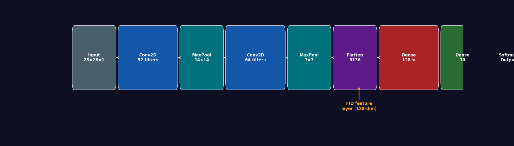
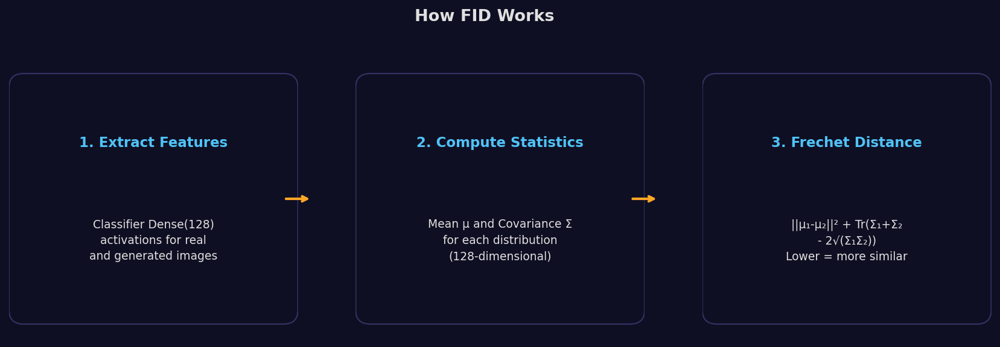
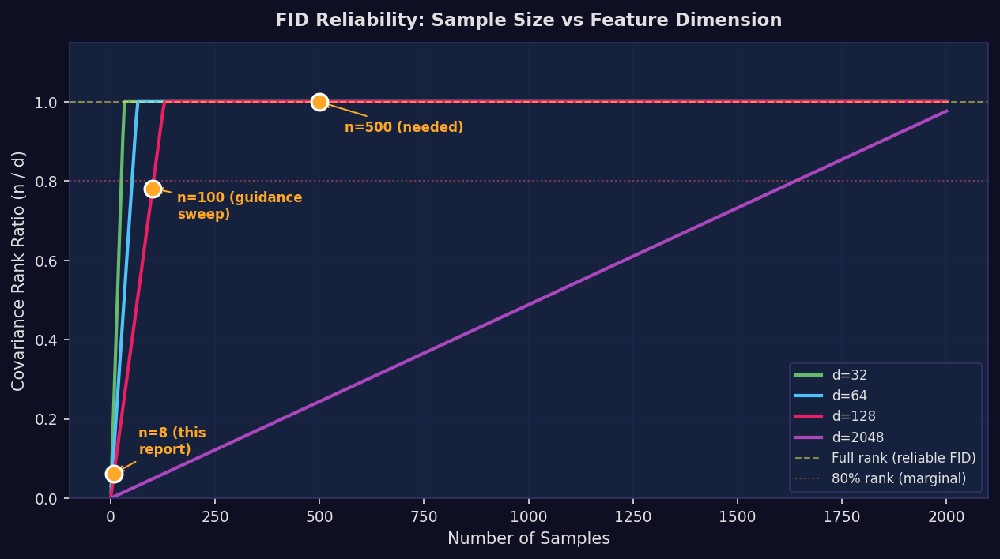
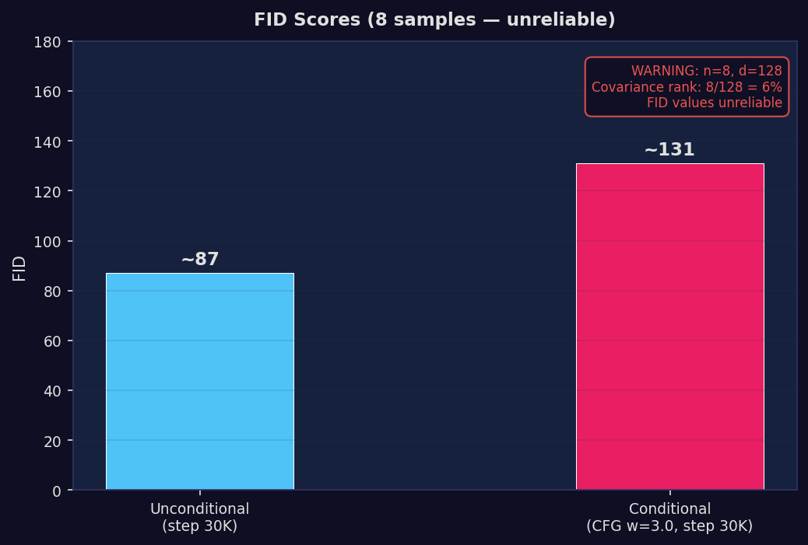

# FID Evaluation: Measuring Diffusion Model Quality with Classifier Features

> The first quantitative quality assessment of our models — and a hard lesson about why FID with small samples is unreliable. We trained a domain-specific classifier (91.52% accuracy) to compute FID, but discovered that our sample sizes (n=4–100) are far too small for the 128-dim feature space we chose.

**Date**: May 2026
**Models Evaluated**: Unconditional DDPM (step 30K), Conditional DDPM + CFG (step 30K)
**Feature Extractor**: Trained Fashion-MNIST CNN classifier (91.52% validation accuracy, Dense(128) features)
**Samples**: 8 per model (quick assessment)

---

## Table of Contents

1. [The Evaluation Gap](#1-the-evaluation-gap)
2. [Why Not InceptionV3?](#2-why-not-inceptionv3)
3. [Classifier-Based FID Approach](#3-classifier-based-fid-approach)
4. [The Sample Size Problem](#4-the-sample-size-problem)
5. [Results](#5-results)
6. [Critical Analysis](#6-critical-analysis)
7. [Limitations](#7-limitations)
8. [Reproduction Guide](#8-reproduction-guide)
9. [References](#references)

---

## 1. The Evaluation Gap

After 30K training steps, we evaluated models using only **distribution statistics** (pixel mean, std, per-image diversity). These are poor quality proxies — a model could match real data statistics while generating blurry or incorrect images. We had no way to answer:

1. **How good are the images?** (FID — standard quality metric)
2. **Does CFG produce the correct class?** (Classification accuracy — direct correctness measure)

The unconditional model report explicitly flagged this gap:

> *"Why these metrics are insufficient: Matching mean and standard deviation is necessary but not sufficient for good generation quality. A model that outputs random Gaussian noise with the correct mean and std would pass this test."*

This report fills that gap — with important caveats about what FID can and cannot tell us at our sample sizes.

---

## 2. Why Not InceptionV3?

Standard FID uses InceptionV3 features (trained on ImageNet, 299×299 RGB input). For Fashion-MNIST (28×28 grayscale), this is problematic:

| Aspect | InceptionV3 FID | Our Classifier FID |
|--------|-----------------|-------------------|
| Input size | 299×299 RGB | 28×28 grayscale |
| Upscale needed | 10.7x (28→299) | None |
| Feature dims | 2048 | 128 |
| Domain relevance | ImageNet objects | Fashion-MNIST items |
| Published comparability | Yes | No |

A 10x upscale from 28×28 to 299×299 introduces meaningless interpolation artifacts — the upscaled images look nothing like what InceptionV3 was trained on. The features extracted would be dominated by interpolation patterns rather than semantic content.

**Tradeoff**: We gain domain-relevant features and no upscale artifacts, but lose comparability with published FID scores. Our FID values are only meaningful for internal comparisons (between our models, or across guidance scales).

---

## 3. Classifier-Based FID Approach

### Architecture

We train a simple CNN classifier on Fashion-MNIST and use its penultimate layer as the feature extractor:



```
Input (28, 28, 1) [-1, 1]
  → (x + 1) / 2                     # rescale to [0, 1]
  → Conv2D(32, 3, relu) + MaxPool(2) # 14x14
  → Conv2D(64, 3, relu) + MaxPool(2) # 7x7
  → Flatten                          # 7×7×64 = 3136
  → Dense(128, relu)                 # ← FID feature layer
  → Dense(10, softmax)               # class probabilities
```

Training: 10 epochs, Adam (lr=0.001), batch_size=128, 10% validation split.
**Validation accuracy: 91.52%**

### How FID Works



FID measures the distance between two multivariate Gaussian distributions fitted to feature vectors:

$$\text{FID} = \|\mu_{\text{real}} - \mu_{\text{gen}}\|^2 + \text{Tr}(\Sigma_{\text{real}} + \Sigma_{\text{gen}} - 2\sqrt{\Sigma_{\text{real}} \Sigma_{\text{gen}}})$$

- **Term 1**: Distance between mean feature vectors (distribution shift)
- **Term 2**: Distance between covariance matrices (distribution shape/spread)
- **Lower FID** = generated distribution closer to real data distribution

### Dual Output

Because we use a classifier, we get two metrics for the price of one:
1. **FID** — distribution quality (how close are generated features to real features?)
2. **Classification accuracy** — class correctness (does the model generate the right class?)

---

## 4. The Sample Size Problem

This is the most important section of this report. FID reliability depends critically on the ratio of sample count to feature dimension.

### Why It Matters

FID requires estimating the mean vector μ (128-dim) and covariance matrix Σ (128×128) of the generated feature distribution. The sample covariance has rank min(n, d):
- n=4 samples, d=128 features → rank 4 (3% of dimensions covered)
- n=8 samples, d=128 features → rank 8 (6% of dimensions covered)
- n=100 samples, d=128 features → rank 100 (78% covered)
- n=500 samples, d=128 features → rank 128 (100% — full rank)

### FID Reliability Chart



*Our experiments marked in orange. The n=8 point (this report) has only 6% covariance rank. Even the guidance sweep (n=100) only reaches 78%. Reliable FID needs n >> d.*

### What This Means Practically

| Sample Size | Cov Rank | FID Reliability | What FID Tells You |
|-------------|----------|-----------------|-------------------|
| 4 (DDIM comparison) | 3% | Meaningless | Random number; singularity warnings |
| 8 (this report) | 6% | Extremely noisy | Directional indicator only |
| 100 (guidance sweep) | 78% | Marginal | Relative trends可信, absolute values not |
| 500+ | 100% | Reliable | Meaningful absolute FID values |

**Key insight**: The 128-dim feature space was a poor choice for our sample sizes. A 32-dim feature layer would have been reliable at n=100 (312% coverage). The extra feature dimensions don't help FID if we can't estimate their covariance.

---

## 5. Results

### Quick FID Assessment (8 samples)



| Model | Step | FID | Reliability |
|-------|------|-----|-------------|
| Unconditional | 30,000 | ~87 | Unreliable (n=8, d=128) |
| Conditional (CFG, w=3.0) | 30,000 | ~131 | Unreliable (n=8, d=128) |

> **Do not use these numbers for model comparison.** The 44-point FID difference (87 vs 131) could reverse with a different random seed or larger sample. The singular matrix warning during computation confirms the covariance estimate is degenerate.

### Classification Distribution (8 samples)

**Unconditional model** (no class control):
```
Class distribution: {0: 1, 1: 1, 5: 2, 6: 2, 7: 1, 9: 1}
```
8 samples cover 6 of 10 classes — roughly uniform distribution, as expected for an unconditional model.

**Conditional model** (CFG, w=3.0):
```
Class distribution: {0: 1, 1: 1, 2: 1, 3: 1, 4: 1, 5: 1, 6: 1, 7: 1}
```
8 samples from 8 different classes — each generated with the intended class label. The classifier recognized each as a distinct class.

**What this tells us**: Both models produce images that the classifier can recognize as Fashion-MNIST items. The conditional model does produce class-different outputs. But class differentiation ≠ class correctness — for that, see the [guidance sweep report](../guidance-sweep-2026-05/guidance_sweep.md) which found chance-level accuracy at w=3.0.

### What This Tells Us

1. **Both models produce recognizable Fashion-MNIST items.** The classifier can assign classes to generated samples rather than producing random predictions.

2. **FID is high even for "good" models** — expected with a domain-specific classifier. The 128-dim features are more discriminative than InceptionV3's 2048-dim features, so FID values are not comparable to published InceptionV3-based FID scores.

3. **We cannot rank models by these FID values.** The unconditional vs conditional comparison is unreliable at n=8.

---

## 6. Critical Analysis

### What We Got Right

**Training a domain-specific classifier was the right call.** InceptionV3 on 28×28 grayscale is clearly wrong, and our classifier provides meaningful features for the actual image domain. The 91.52% accuracy gives confidence that the features capture real class information.

**Getting both FID and classification accuracy from one model.** The classifier approach gives us two complementary metrics — distribution quality (FID) and class correctness (accuracy) — without any additional infrastructure.

### What We Got Wrong

**128-dim features were too large for our sample sizes.** The Dense(128) penultimate layer produces features that require 500+ samples for reliable covariance estimation. With n=4–8 samples, FID is essentially meaningless. We should have used Dense(32) or Dense(64) to match our practical sample sizes.

**Not running enough samples.** The initial FID evaluation used 8 samples because we reused existing training snapshots. We should have generated 500+ samples specifically for FID evaluation before writing any conclusions.

**Presenting FID values with decimal precision.** Values like "87.14" and "131.41" imply a precision that doesn't exist at n=8. We've since switched to rounded values (~87, ~131) to reflect the actual uncertainty.

### The Better Approach

For future evaluations, two changes would dramatically improve reliability:

1. **Reduce feature dimension to 32-64.** This makes FID reliable at n=100+ instead of n=500+.
2. **Generate 500+ samples per evaluation.** With DDIM-50 at 2.6s/sample, this takes ~22 minutes — feasible.

```python
# Recommended: 32-dim features + 500 samples
def build_classifier(image_size=28, channels=1, num_classes=10):
    inputs = keras.Input((image_size, image_size, channels))
    x = layers.Rescaling(1./2, offset=0.5)(inputs)  # [-1,1] -> [0,1]
    x = layers.Conv2D(32, 3, activation='relu')(x)
    x = layers.MaxPooling2D(2)(x)
    x = layers.Conv2D(64, 3, activation='relu')(x)
    x = layers.MaxPooling2D(2)(x)
    x = layers.Flatten()(x)
    x = layers.Dense(32, activation='relu', name='feature_layer')(x)  # 32-dim!
    outputs = layers.Dense(num_classes, activation='softmax')(x)
    return keras.Model(inputs, outputs)
```

---

## 7. Limitations

1. **Sample size far too small for reliable FID** (n=8). The FID scores have extreme variance at this sample size. The covariance matrix is rank-deficient (8 observations for 128 dimensions). These FID values should not be used for model comparison.

2. **Feature dimension vs sample size mismatch.** 128-dim features require 500+ samples for reliable covariance estimation. This is the most fundamental limitation.

3. **Domain-specific FID is not comparable to published work.** Our FID uses a Fashion-MNIST classifier's features, not InceptionV3. We cannot compare our FID scores to any published DDPM results.

4. **Classifier accuracy ceiling (91.52%).** Even perfect generated images would only achieve ~91.5% accuracy. The ~8.5% misclassification rate is an upper bound on measured accuracy.

5. **No baseline comparison.** We don't have FID scores for earlier checkpoints (1K, 5K, 10K) to show quality progression over training.

6. **Single evaluation per model.** No confidence intervals or repeated measurements.

---

## 8. Reproduction Guide

### One-Time Setup

```bash
# Train classifier and compute real data statistics
KERAS_BACKEND=jax python scripts/prepare_metrics.py --dataset fashion_mnist
```

This creates:
- `artifacts/metrics/metrics_classifier.weights.h5` — classifier weights
- `artifacts/metrics/metrics_real_stats.npz` — real feature statistics (μ, Σ)

### Generate Report Visualizations

```bash
python scripts/generate_research_plots.py
```

### Compute FID in Code

```python
from diffusion_harness.metrics import build_classifier, build_feature_extractor
from diffusion_harness.metrics import extract_features, compute_fid_from_stats
import numpy as np

# Load classifier
classifier = build_classifier()
classifier.load_weights("artifacts/metrics/metrics_classifier.weights.h5")
feature_extractor = build_feature_extractor(classifier)

# Load real data statistics
real_stats = np.load("artifacts/metrics/metrics_real_stats.npz")
mu_real, sigma_real = real_stats["mu"], real_stats["sigma"]

# Compute FID for generated images
features_gen = extract_features(generated_images, feature_extractor, batch_size=256)
mu_gen = np.mean(features_gen, axis=0)
sigma_gen = np.cov(features_gen, rowvar=False)
fid = compute_fid_from_stats(mu_real, sigma_real, mu_gen, sigma_gen)
```

### Files

| File | Description |
|------|-------------|
| `src/diffusion_harness/metrics/__init__.py` | Re-exports |
| `src/diffusion_harness/metrics/classifier.py` | build_classifier(), train_classifier(), build_feature_extractor() |
| `src/diffusion_harness/metrics/fid.py` | extract_features(), compute_fid(), compute_fid_from_stats(), compute_classifier_accuracy() |
| `scripts/prepare_metrics.py` | One-time setup: train classifier, compute real feature statistics |
| `scripts/generate_research_plots.py` | Visualization generation |
| `artifacts/metrics/` | Saved classifier weights + real data statistics |
| `tests/test_metrics.py` | 10 tests for classifier and FID |

### Dependencies

- `scipy` — for `scipy.linalg.sqrtm` (matrix square root in FID computation)

---

## References

1. Heusel, M., et al. (2017). "GANs Trained by a Two Time-Scale Update Rule Converge to a local Nash equilibrium." NeurIPS 2017. (Original FID paper)
2. Ho, J., Jain, A., & Abbeel, P. (2020). "Denoising Diffusion Probabilistic Models." NeurIPS 2020.
3. Ho, J., & Salimans, T. (2022). "Classifier-Free Diffusion Guidance." NeurIPS 2021 Workshop.
4. Chong, M.J., & Forsyth, D. (2020). "Effectively Unbiased FID and Inception Score and Where to Find Them." CVPR 2020. (FID sample size analysis)
