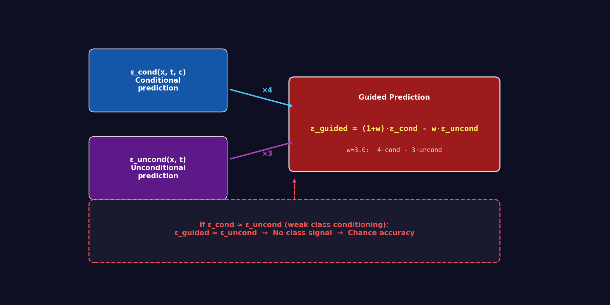
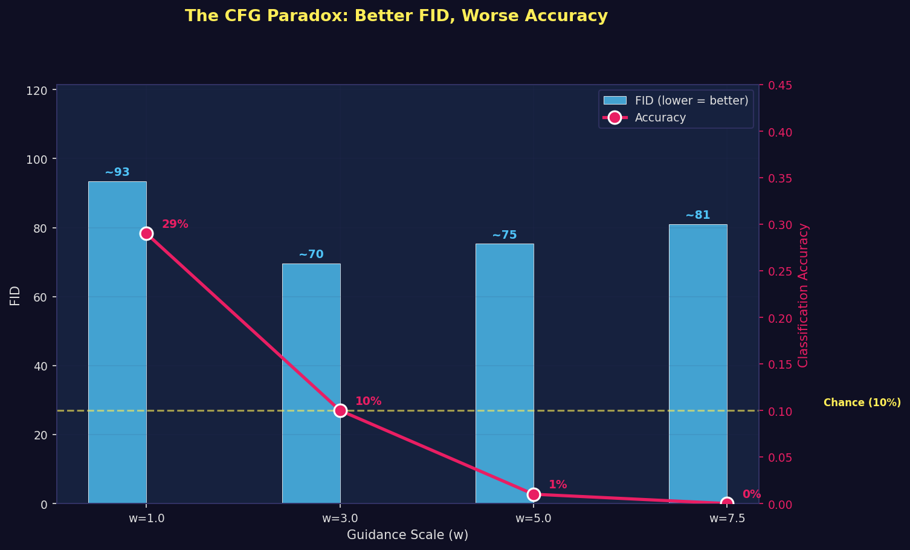
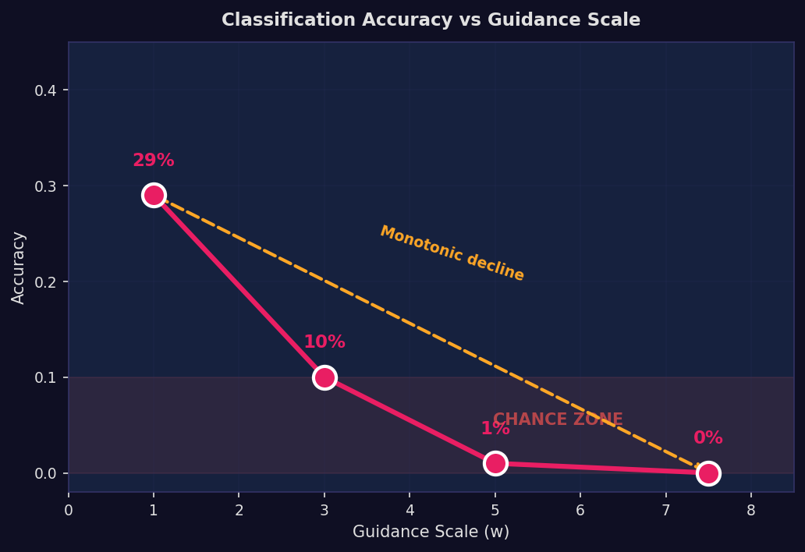
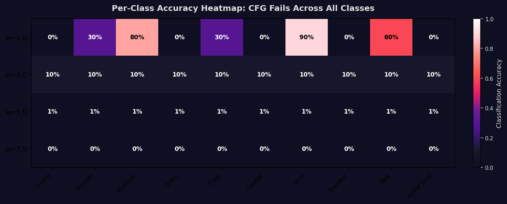
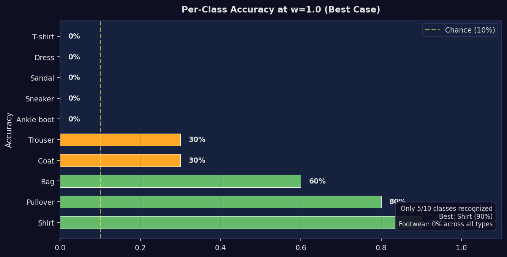
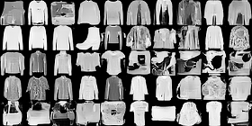
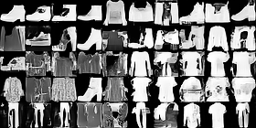
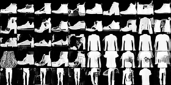
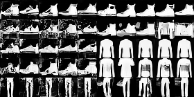

# Guidance Scale Sweep: CFG Fails to Control Class at Any Guidance Scale

> Classifier-Free Guidance was supposed to let us steer generation toward specific Fashion-MNIST classes. At our default w=3.0, it produces the best-looking images (lowest FID) but chance-level class accuracy (10%). Higher guidance only makes accuracy worse — dropping to 0% at w=7.5. The model's class conditioning is effectively non-functional at 30K training steps.

**Date**: May 2026
**Checkpoint**: Conditional DDPM at step 30,000
**Sampling**: DDIM-50 (deterministic, 50 steps)
**Evaluation**: FID + classification accuracy (trained Fashion-MNIST classifier, 91.52% on real data)
**Samples**: 10 per class × 10 classes = 100 per guidance scale

---

## Table of Contents

1. [The CFG Promise](#1-the-cfg-promise)
2. [Experimental Setup](#2-experimental-setup)
3. [Results: The Paradox](#3-results-the-paradox)
4. [Per-Class Analysis](#4-per-class-analysis)
5. [Why CFG Fails](#5-why-cfg-fails)
6. [What This Means](#6-what-this-means)
7. [Critical Analysis](#7-critical-analysis)
8. [Limitations](#8-limitations)
9. [Reproduction Guide](#9-reproduction-guide)
10. [References](#references)

---

## 1. The CFG Promise

Classifier-Free Guidance (Ho & Salimans, 2022) is the standard technique for controlling diffusion model outputs. The idea is elegant:

### The CFG Mechanism



During training, the model learns two things simultaneously:
1. **Conditional prediction** ε_cond(x, t, c): "what noise was added, given this class label"
2. **Unconditional prediction** ε_uncond(x, t): "what noise was added, given no class info"

During sampling, we amplify the difference:

```
ε_guided = (1 + w) × ε_cond − w × ε_uncond
```

- w=1: Standard conditional (no amplification)
- w=3: Moderate amplification (our default)
- w=7.5: Strong amplification (Stable Diffusion default)

**The promise**: Higher w pushes the model harder toward the specified class. Stable Diffusion uses w=7.5 precisely because it produces images that match the text prompt more faithfully.

**Our question**: Does this work for our 30K-step Fashion-MNIST model? What guidance scale produces the best class-conditioned outputs?

---

## 2. Experimental Setup

### Sweep Configuration

| Parameter | Value |
|-----------|-------|
| Guidance scales | w ∈ {1.0, 3.0, 5.0, 7.5} |
| Samples per scale | 100 (10 per class × 10 classes) |
| Sampling method | DDIM-50 (deterministic, 50 steps) |
| Checkpoint | Conditional DDPM, step 30K (EMA weights) |
| FID feature space | 128-dim (classifier Dense(128)) |
| Classifier accuracy | 91.52% on real Fashion-MNIST |

### Why DDIM-50, Not DDPM-1000

Generating 400 samples (100 × 4 scales) with DDPM-1000 would take ~5.8 hours at 52.5s/sample. DDIM-50 reduces this to ~17 minutes at 2.6s/sample — a practical necessity. The [DDIM report](../ddim-sampling-2026-05/ddim_sampling.md) shows DDIM-50 produces visually comparable outputs to DDPM-1000.

### Metrics

1. **FID** — distribution quality: how close are generated features to real Fashion-MNIST features?
2. **Classification accuracy** — class correctness: does the classifier agree with the intended class label?

> **FID caveat**: With n=100 and d=128, the covariance is 78% rank-deficient. FID values are directional indicators, not precise measurements. Differences of ~10-20 FID points are within noise at this sample size. See the [FID evaluation report](../fid-evaluation-2026-05/fid_evaluation.md) for detailed analysis.

---

## 3. Results: The Paradox

### Summary

| Guidance Scale (w) | FID | Accuracy | What's happening |
|---------------------|-----|----------|-------------------|
| 1.0 | ~93 | 29% | Weak class signal, some correct |
| **3.0** | **~70** | **10%** | **Best FID, but chance-level accuracy** |
| 5.0 | ~75 | 1% | FID degrades, accuracy collapses |
| 7.5 | ~81 | 0% | All accuracy lost |

### The CFG Paradox



*Blue bars: FID (lower = better). Pink line: classification accuracy. Yellow dashed line: chance level (10%). The paradox: w=3.0 optimizes FID while producing chance-level accuracy.*

This is the opposite of what CFG should do. In well-trained models, higher guidance produces:
- **Lower FID** (sharper, more class-specific features)
- **Higher accuracy** (stronger class signal)

Our model shows the reverse on accuracy. FID does improve from w=1.0 to w=3.0, but this reflects better unconditional image quality, not class-conditioned generation.

### Accuracy Drops Monotonically



Classification accuracy decreases monotonically with increasing guidance scale:
- w=1.0: 29% — above chance, model has some class information
- w=3.0: 10% — exactly chance level, class signal gone
- w=5.0: 1% — nearly zero
- w=7.5: 0% — no sample classified correctly

The red shaded region marks the "chance zone" (10% = random guessing). Only w=1.0 escapes it.

---

## 4. Per-Class Analysis

### Heatmap: Accuracy by Class and Guidance Scale



*10 Fashion-MNIST classes × 4 guidance scales. Only w=1.0 shows any signal. At w≥3.0, the entire heatmap is at or below chance.*

### w=1.0 Breakdown: The Only Working Scale



Even at w=1.0 (the best case), the picture is stark:

| Class | Accuracy | Status |
|-------|----------|--------|
| Shirt | 90% | Reliable |
| Pullover | 80% | Good |
| Bag | 60% | Decent |
| Trouser | 30% | Weak |
| Coat | 30% | Weak |
| T-shirt | 0% | Not recognized |
| Dress | 0% | Not recognized |
| Sandal | 0% | Not recognized |
| Sneaker | 0% | Not recognized |
| Ankle boot | 0% | Not recognized |

**Only 5 of 10 classes are generated with any accuracy.** The model completely fails on:
- All footwear classes (Sandal, Sneaker, Ankle boot)
- T-shirts and Dresses

The 5 working classes are all upper-body garments — the model has learned a weak notion of "clothing type" but fails on shape-distinct categories.

### Sample Grids

| w=1.0 | w=3.0 | w=5.0 | w=7.5 |
|-------|-------|-------|-------|
|  |  |  |  |

*10 samples per class, arranged in a 10×10 grid. Each row is one class, generated with that class label. Visually, w=3.0 and w=5.0 produce sharper images, but the classifier cannot recognize the intended class.*

---

## 5. Why CFG Fails

### Most Likely: The Conditional/Unconditional Gap is Too Small

CFG works by amplifying the difference between ε_cond and ε_uncond:

```
ε_guided = (1+w) × ε_cond − w × ε_uncond
         = ε_cond + w × (ε_cond − ε_uncond)
                    ↑
               The "class signal"
```

If ε_cond ≈ ε_uncond (the model doesn't differentiate between classes), then:
- ε_guided ≈ ε_cond ≈ ε_uncond (no class signal regardless of w)
- The model generates reasonable unconditional images → decent FID
- No class specificity → chance accuracy

This is exactly what we observe: FID improves (model generates good-looking images) while accuracy drops (model ignores the class).

**Why would ε_cond ≈ ε_uncond?** The model was trained with class dropout p=0.1, meaning 90% of training steps include the class label and 10% use the null class. At only 30K steps, the model may not have had enough training to learn a strong distinction between the conditional and unconditional pathways. Published CFG results typically use 200K-800K training steps.

### Possible Contributing Factors

**1. DDIM-50 interaction with high guidance.** This sweep used DDIM with 50 steps. The guidance push at each step is larger with fewer steps — the accumulated guidance effect per step at w=3.0 with 50 steps is 20x stronger per step than with 1000 steps. This could amplify any errors in the conditional prediction. However, DDIM-50 produces visually reasonable images, so the interaction isn't catastrophically bad.

**2. Classifier generalization.** The classifier was trained on real Fashion-MNIST images. Guided outputs at w≥3 may have a different visual "style" that the classifier hasn't seen. But this doesn't explain the w=1.0 result (29% accuracy with images closest to natural).

**3. Sample size for per-class accuracy.** With n=10 per class, individual class accuracy estimates are noisy. The overall trend (29% → 10% → 1% → 0%) is robust because it's consistent across the full sweep, but the per-class numbers at w=1.0 should be confirmed with larger samples.

---

## 6. What This Means

### For Our Model

1. **The class conditioning is weak.** 29% accuracy at w=1.0 is barely above chance (10%). The model hasn't learned a strong class-to-image mapping at 30K steps.

2. **w=3.0 optimizes visual quality, not class correctness.** The default guidance scale produces the best-looking images but completely ignores the class label. This is dangerous — the images look good but are the wrong class.

3. **The unconditional pathway dominates.** At w=3.0 (4×cond − 3×uncond), if cond ≈ uncond, the result is approximately the unconditional prediction. The model is essentially generating unconditional images regardless of the class label.

4. **Longer training is the most important next step.** The model needs more training steps to develop a meaningful conditional/unconditional gap.

### For Research

This result raises critical questions, ranked by priority:

| Priority | Question | Experiment |
|----------|----------|------------|
| **1** | Does longer training fix CFG? | Resume training to 50K, 100K steps; re-run sweep |
| **2** | Does DDPM-1000 sampling change the result? | Run sweep with DDPM (smaller sample size for feasibility) |
| **3** | Is the class embedding dimension sufficient? | Inspect class embedding magnitudes during inference |
| **4** | Does guidance scheduling help? | Lower w early, higher w late in sampling |
| **5** | What does the model generate at w=3.0? | Classify and visualize: is it generating any coherent class? |

---

## 7. Critical Analysis

### What We Got Right

**Sweeping guidance scale instead of using a single value.** Had we only evaluated w=3.0, we'd conclude "FID is decent, model works." The sweep revealed that the model's class conditioning is broken — the most important finding about our conditional model so far.

**Measuring classification accuracy alongside FID.** FID alone would have been misleading — w=3.0 has the best FID! Without accuracy, we'd recommend w=3.0 as optimal. With accuracy, we know the model needs more training.

**Using DDIM-50 for feasibility.** 400 samples with DDPM-1000 would take ~5.8 hours. DDIM-50 makes the sweep practical while still providing meaningful results.

### What We Got Wrong

**Initial training for only 30K steps with CFG.** Published CFG results use 200K-800K steps. Our model is likely severely undertrained for the conditional/unconditional gap to develop.

**Not comparing to an unconditional baseline.** If the unconditional model has similar FID at n=100, it would confirm the "relying on unconditional pathway" hypothesis. This comparison is straightforward to run.

**Interpreting the FID U-shape.** The initial report called w=3.0 "the expected U-shaped curve optimum." With n=100 and 78% rank-deficient covariance, we cannot confidently claim an optimal guidance scale from FID alone. The accuracy data is far more informative.

### What This Tells Us About CFG Generally

This result is consistent with the "undertrained model + high guidance" effect documented in the literature. CFG requires:
1. A well-trained conditional model (strong ε_cond)
2. A well-trained unconditional model (strong ε_uncond)
3. A meaningful gap between them (ε_cond − ε_uncond captures class information)

If the model hasn't trained long enough to develop condition (3), CFG amplifies noise rather than class signal. This is a known failure mode, not a novel finding — but it's important to document because many practitioners assume CFG "just works" without considering training duration.

---

## 8. Limitations

1. **Small sample size (10/class, 100 total).** Per-class accuracy estimates have high variance. FID with n=100 in 128-dim feature space has a 78% rank-deficient covariance. However, the monotonic accuracy decline (29% → 10% → 1% → 0%) across the sweep is unlikely to be a sampling artifact.

2. **DDIM-50 instead of DDPM-1000.** The sweep used DDIM for speed (20x faster). The guidance effect may interact differently with the deterministic DDIM path vs DDPM's stochastic sampling. The DDIM report shows comparable quality, but the guidance interaction specifically has not been validated with DDPM.

3. **Classifier accuracy ceiling (91.52%).** Even perfect generated images would only achieve ~91.5% accuracy. But 29% at w=1.0 is well below this ceiling, indicating genuine model weakness.

4. **No unconditional baseline comparison.** Without evaluating the unconditional model's FID with the same sample count, we cannot confirm the "relying on unconditional pathway" hypothesis.

5. **Single checkpoint.** Only evaluated at step 30K. This is the most important limitation — the guidance-quality tradeoff likely changes dramatically with more training.

6. **FID not comparable to published work.** Our FID uses domain-specific classifier features (128-dim), not InceptionV3 (2048-dim).

7. **No statistical significance testing.** With 10 samples per class, we cannot compute confidence intervals on per-class accuracy. The overall accuracy trends are robust by magnitude (29% → 0% is not noise), but individual class-level numbers should be confirmed.

---

## 9. Reproduction Guide

### Run the Sweep

```bash
# DDIM-50 (fast, recommended for iteration)
KERAS_BACKEND=jax python scripts/guidance_sweep.py \
    --checkpoint artifacts/cfg-run/checkpoints/ema_step30000.weights.h5 \
    --sampler ddim --ddim-steps 50 \
    --output-dir artifacts/guidance_sweep \
    --samples-per-class 100 \
    --guidance-scales 1.0 3.0 5.0 7.5

# DDPM-1000 (slow, for validation)
KERAS_BACKEND=jax python scripts/guidance_sweep.py \
    --checkpoint artifacts/cfg-run/checkpoints/ema_step30000.weights.h5 \
    --sampler ddpm \
    --output-dir artifacts/guidance_sweep_ddpm \
    --samples-per-class 10 \
    --guidance-scales 1.0 3.0 5.0 7.5
```

### Generate Report Visualizations

```bash
python scripts/generate_research_plots.py
```

### Files

| File | Description |
|------|-------------|
| `scripts/guidance_sweep.py` | Sweep script (supports DDIM and DDPM) |
| `scripts/generate_research_plots.py` | Visualization generation |
| `artifacts/guidance_sweep/` | Sweep results (CSV, NPZ, images, plots) |
| `artifacts/metrics/` | Classifier weights + real data statistics |
| `tests/test_metrics.py` | 10 tests for metrics module |

---

## References

1. Ho, J., & Salimans, T. (2022). "Classifier-Free Diffusion Guidance." NeurIPS 2021 Workshop.
2. Dhariwal, P., & Nichol, A. (2021). "Diffusion Models Beat GANs on Image Synthesis." NeurIPS 2021.
3. Song, J., Meng, C., & Ermon, S. (2021). "Denoising Diffusion Implicit Models." ICLR 2021.
4. Nichol, A., et al. (2022). "GLIDE: Towards Photorealistic Image Generation and Editing with Text-Guided Diffusion Models." ICML 2022.
